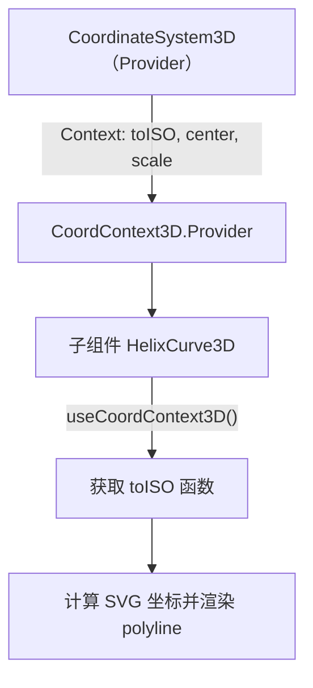
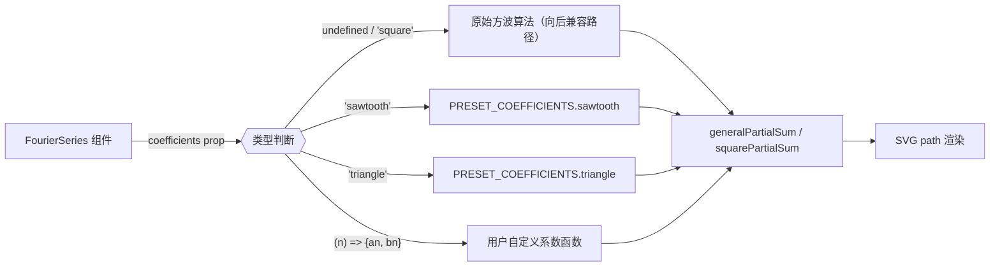

# 开发会话总结 · 2026-04-08 · v3

> **项目**：Remotion 高等数学教学动画  
> **路径**：`/Users/zsk/Downloads/code/math`  
> **会话时间**：2026-04-08（UTC+8）  
> **编写时间**：2026-04-08T11:00 CST  
> **前序文档**：[SESSION_SUMMARY_20260408_v2.md](./SESSION_SUMMARY_20260408_v2.md)

---

## 1. 概述

| 项目 | 内容 |
|------|------|
| **会话目标** | 完成 v2 文档中列出的全部三项 P3 改进 |
| **改进数量** | 3 项（改进A / B / C） |
| **完成状态** | ✅ 全部完成，TypeScript 编译零错误 |
| **影响文件数** | 8 个（1 个新建 + 7 个修改） |
| **净增代码行** | 约 +250 行 |

本轮（P3 改进）在 v2 会话已将项目修复至 41/41 节全部完整的基础上，进一步提升了组件库的**表达力、通用性与 API 一致性**：

- **改进A**：新建 `CoordinateSystem3D` 三维等轴测组件，解决三维空间概念无法准确可视化的问题
- **改进B**：通用化 `FourierSeries` 组件，引入策略模式支持多种波形，同时保持向后兼容
- **改进C**：统一 `fade()` API 语义为 `duration` 模式，迁移全部旧式调用，消除混乱的双语义问题

```
改进前组件状态：
  ├─ CoordinateSystem3D：❌ 不存在（三维内容使用裸 SVG 二维投影近似）
  ├─ FourierSeries：⚠️ 仅支持方波，硬编码系数
  └─ fade() API：⚠️ 双语义并存（duration vs. end-frame）

改进后组件状态：
  ├─ CoordinateSystem3D：✅ 等轴测投影，Context API，子组件可组合
  ├─ FourierSeries：✅ 支持 square/sawtooth/triangle 预设 + 自定义函数
  └─ fade() API：✅ 统一 duration 语义，新增 fadeToEnd() 保留旧能力
```

---

## 2. 新增 / 修改文件清单

| 文件路径 | 修改类型 | 净增行数 | 说明 |
|----------|----------|----------|------|
| [`src/components/math/CoordinateSystem3D.tsx`](../src/components/math/CoordinateSystem3D.tsx) | **新建** | +167 行 | 三维等轴测投影组件 |
| [`src/compositions/Ch08_VectorGeometry/Sec04_Curves.tsx`](../src/compositions/Ch08_VectorGeometry/Sec04_Curves.tsx) | 修改 | +~20 行 | Scene 2 替换为 3D 螺旋线视图 |
| [`src/components/math/FourierSeries.tsx`](../src/components/math/FourierSeries.tsx) | 修改 | +39 行 | 新增通用化类型和预设系数 |
| [`src/utils/animationUtils.ts`](../src/utils/animationUtils.ts) | 修改 | +8 行 | `fade()` 改 duration 语义，新增 `fadeToEnd()` |
| [`src/compositions/Ch07_DifferentialEq/Sec03_Homogeneous.tsx`](../src/compositions/Ch07_DifferentialEq/Sec03_Homogeneous.tsx) | 迁移 | 0 | 14 处 fade() 调用已转换 |
| [`src/compositions/Ch07_DifferentialEq/Sec05_Exact.tsx`](../src/compositions/Ch07_DifferentialEq/Sec05_Exact.tsx) | 迁移 | 0 | 14 处 fade() 调用已转换 |
| [`src/compositions/Ch07_DifferentialEq/Sec06_HighOrder.tsx`](../src/compositions/Ch07_DifferentialEq/Sec06_HighOrder.tsx) | 迁移 | 0 | 15 处 fade() 调用已转换 |
| [`src/compositions/Ch07_DifferentialEq/Sec07_Linear2.tsx`](../src/compositions/Ch07_DifferentialEq/Sec07_Linear2.tsx) | 迁移 | 0 | 15 处 fade() 调用已转换 |

---

## 3. 改进A：CoordinateSystem3D 等轴测投影组件

### 3.1 问题背景

Ch08（向量几何）包含螺旋线、空间曲面等大量三维概念，v2 会话中 `Sec04_Curves.tsx` Scene 2 仅使用裸 SVG 绘制 x-z 二维投影，无法准确表达空间螺旋轨迹。

### 3.2 等轴测投影原理

**等轴测投影（Isometric Projection）** 将三维坐标 (x, y, z) 映射到二维 SVG 平面，三个轴夹角均为 120°，无透视收缩：

$$
\text{svgX} = c_x + (x - y) \cdot \cos 30° \cdot \text{scale}
$$
$$
\text{svgY} = c_y + (x + y) \cdot \sin 30° \cdot \text{scale} - z \cdot \text{scale}
$$

其中 $\cos 30° = \frac{\sqrt{3}}{2} \approx 0.866$，$\sin 30° = 0.5$，$(c_x, c_y)$ 为 SVG 坐标系原点。

**代码实现**：

```tsx
// src/components/math/CoordinateSystem3D.tsx
const COS30 = Math.sqrt(3) / 2; // ≈ 0.866
const SIN30 = 0.5;

const toISO: ToISOFn = (x, y, z) => ({
  svgX: cx + (x - y) * COS30 * scale,
  svgY: cy + (x + y) * SIN30 * scale - z * scale,
});
```

**三轴投影方向示意：**

```
       z ↑
        |   ↗ y
        |  /
        | /
        |/____________→ x
       O

等轴测视图（120° 夹角）：
        z
        │
        │    y
        │   ╱
        │  ╱
        │ ╱
────────┼╱──────── x
```

### 3.3 Context 机制设计

组件通过 React Context 将 `toISO` 函数传递给任意层级的子组件，避免 props 透传：



**Context 类型定义：**

```tsx
interface CoordContext3DType {
  toISO: ToISOFn;      // 三维→SVG 投影函数
  center: [number, number];  // SVG 原点位置
  scale: number;             // 像素/单位比例
}
```

**渲染顺序（Painter's Algorithm）：**

```
grid（xy 平面网格）
  → axes（xyz 坐标轴 + 箭头 + 标签）
    → children（用户自定义内容）
```

### 3.4 组件 API

```tsx
// 完整 Props 接口
export interface CoordinateSystem3DProps {
  center?: [number, number];   // SVG 原点，默认 [540, 400]
  scale?: number;              // 像素/单位，默认 60
  xRange?: [number, number];   // x 轴范围，默认 [-3, 3]
  yRange?: [number, number];   // y 轴范围，默认 [-3, 3]
  zRange?: [number, number];   // z 轴范围，默认 [0, 4]
  showGrid?: boolean;          // 显示 xy 网格，默认 true
  axisColor?: string;          // 坐标轴颜色，默认 '#94A3B8'
  gridColor?: string;          // 网格线颜色，默认 '#1E293B'
  width?: number;              // SVG 宽度，默认 500
  height?: number;             // SVG 高度，默认 450
  children?: React.ReactNode;
}

// 子组件 Hook（必须在 CoordinateSystem3D 内部调用）
export function useCoordContext3D(): CoordContext3DType
```

**使用示例（来自 `Sec04_Curves.tsx`）：**

```tsx
// 子组件：在 CoordinateSystem3D 上下文内使用 toISO
const HelixCurve3D: React.FC<{ drawProgress: number }> = ({ drawProgress }) => {
  const { toISO } = useCoordContext3D();
  const N = 200;
  const drawn = Math.floor(drawProgress * N);
  const points: string[] = [];
  for (let i = 0; i < drawn; i++) {
    const t = (i / N) * 4 * Math.PI;
    const { svgX, svgY } = toISO(Math.cos(t), Math.sin(t), 0.3 * t);
    points.push(`${svgX},${svgY}`);
  }
  return (
    <polyline
      points={points.join(' ')}
      fill="none"
      stroke={COLORS.primaryCurve}
      strokeWidth={2}
    />
  );
};

// 父组件：包裹 CoordinateSystem3D
<CoordinateSystem3D center={[280, 210]} scale={55} zRange={[0, 4]}>
  <HelixCurve3D drawProgress={s2Draw} />
</CoordinateSystem3D>
```

**螺旋线参数方程：**
- $x(t) = \cos t$
- $y(t) = \sin t$  
- $z(t) = 0.3t$，其中 $t \in [0, 4\pi]$

### 3.5 导出清单

| 导出名 | 类型 | 说明 |
|--------|------|------|
| `CoordinateSystem3D` | `React.FC` | 主组件 |
| `useCoordContext3D` | Hook | 获取投影上下文 |
| `CoordinateSystem3DProps` | interface | Props 类型 |
| `CoordContext3DType`（内部） | interface | Context 类型 |
| `ToISOFn` | type | 投影函数类型 |
| `ToISOResult` | interface | 投影结果类型 |

---

## 4. 改进B：FourierSeries 组件通用化

### 4.1 问题背景

原 [`src/components/math/FourierSeries.tsx`](../src/components/math/FourierSeries.tsx) 将方波傅里叶系数硬编码在组件内部，无法支持 `Sec06_Fourier.tsx` 和 `Sec07_Fourier2.tsx` 可能需要的锯齿波、三角波等其他函数展开。

### 4.2 通用化设计：策略模式

本次采用**策略模式（Strategy Pattern）** 将"系数计算"策略从组件主体中分离，通过 `coefficients` prop 注入：



### 4.3 内置预设公式表

| 预设名 | 波形 | 傅里叶系数公式 | 收敛特征 |
|--------|------|----------------|----------|
| `'square'` | 方波 | $b_n = \dfrac{4}{n\pi}$（仅奇数 $n$）| 吉布斯现象明显，$O(1/n)$ 收敛 |
| `'sawtooth'` | 锯齿波 | $b_n = \dfrac{2(-1)^{n+1}}{n\pi}$（所有 $n$）| 正负交替，$O(1/n)$ 收敛 |
| `'triangle'` | 三角波 | $a_n = \dfrac{8(-1)^{(n-1)/2}}{n^2\pi^2}$（仅奇数 $n$）| $O(1/n^2)$ 收敛，更光滑 |

**代码实现：**

```tsx
// src/components/math/FourierSeries.tsx
export type FourierCoeffFn = (n: number) => { an: number; bn: number };
export type FourierPreset = 'square' | 'sawtooth' | 'triangle';

const PRESET_COEFFICIENTS: Record<FourierPreset, FourierCoeffFn> = {
  square: (n) => ({
    an: 0,
    bn: n % 2 === 1 ? 4 / (n * Math.PI) : 0,
  }),
  sawtooth: (n) => ({
    an: 0,
    bn: (2 * Math.pow(-1, n + 1)) / (n * Math.PI),
  }),
  triangle: (n) => ({
    an: n % 2 === 1
      ? (8 / (n * n * Math.PI * Math.PI)) * Math.pow(-1, (n - 1) / 2)
      : 0,
    bn: 0,
  }),
};
```

### 4.4 向后兼容保证

通过以下双路径机制确保现有调用方（`Sec06_Fourier.tsx`、`Sec07_Fourier2.tsx`）**零改动**：

```tsx
// 判断是否走兼容路径
const isDefaultSquare = !coefficients || coefficients === 'square';

// 原始方波逻辑（奇数谐波迭代，与旧版行为完全一致）
const squarePartialSum = (x: number, n: number): number => {
  let sum = 0;
  for (let k = 1; k <= n; k++) {
    sum += Math.sin((2 * k - 1) * x) / (2 * k - 1);
  }
  return (4 / Math.PI) * sum;
};

// 通用路径（使用 coefficients 解析）
const calcPartialSum = isDefaultSquare ? squarePartialSum : generalPartialSum;
```

**兼容性验证：**

```
✅ Sec06_Fourier.tsx     — <FourierSeries terms={7} /> （不传 coefficients）→ 走方波兼容路径
✅ Sec07_Fourier2.tsx    — <FourierSeries terms={15} /> （不传 coefficients）→ 走方波兼容路径
✅ 新增用法               — <FourierSeries terms={7} coefficients="triangle" /> → 走通用路径
✅ 自定义函数             — <FourierSeries terms={5} coefficients={(n) => ({an: 1/n, bn: 0})} />
```

### 4.5 更新后 Props 接口

```tsx
export interface FourierSeriesProps {
  terms: number;                              // 展示的项数
  drawProgress?: number;                      // 绘制进度 0~1，默认 1
  showPartialSums?: boolean;                  // 是否显示各阶部分和，默认 true
  color?: string;                             // 最终曲线颜色
  /** 系数来源：预设名称或自定义系数函数。不传时为方波（向后兼容） */
  coefficients?: FourierPreset | FourierCoeffFn;
}
```

---

## 5. 改进C：fade() API 统一化

### 5.1 问题背景

v2 文档中识别到项目内存在两套 `fade()` 调用语义：

| 旧用法（部分文件） | 语义 |
|-------------------|------|
| `fade(frame, 30, 60)` | 从第 30 帧到第 60 帧渐入（**绝对帧**） |
| `fade(frame, 30, 30)` | 歧义：持续 30 帧还是到第 30 帧？ |

这导致：
1. 读者难以区分第三参数含义
2. `fade(frame, start, start + duration)` 模式冗余，易出错
3. 不同文件中相同功能使用不同写法，代码风格不一致

### 5.2 新语义：duration（持续帧数）

```tsx
// src/utils/animationUtils.ts

/**
 * fade(frame, start, duration=30)
 * 从 start 帧开始，持续 duration 帧渐入到 1
 * 在 [start, start+duration] 帧范围内线性插值
 */
export const fade = (frame: number, start: number, duration = 30): number =>
  interpolate(frame, [start, start + duration], [0, 1], {
    extrapolateLeft: 'clamp',
    extrapolateRight: 'clamp',
  });

/**
 * fadeToEnd(frame, start, end)
 * 保留旧语义：从 start 帧到 end 帧（绝对帧位置）渐入
 * 供特殊需求使用（如需精确对齐帧位的动画）
 */
export const fadeToEnd = (frame: number, start: number, end: number): number =>
  interpolate(frame, [start, end], [0, 1], {
    extrapolateLeft: 'clamp',
    extrapolateRight: 'clamp',
  });
```

### 5.3 为何选择 duration 语义

| 对比维度 | `end` 语义（旧） | `duration` 语义（新）|
|----------|-----------------|----------------------|
| **可读性** | `fade(f, 30, 60)` — 第三参数 60 是帧号还是持续帧？不直观 | `fade(f, 30, 30)` — 持续 30 帧，语义一目了然 |
| **移植性** | 调整动画起始帧时须同步修改两个参数 | 只须修改 `start`，`duration` 保持不变 |
| **默认值** | 无法有意义的默认值 | `duration = 30`（1秒）可作为合理默认 |
| **常见模式** | `fade(f, s, s + 30)` 重复计算加法 | `fade(f, s)` 使用默认即可 |

### 5.4 迁移规则

**转换公式：**

```
旧：fade(frame, start, end)
新：fade(frame, start, end - start)
```

**批量迁移示例（`Sec03_Homogeneous.tsx`）：**

```tsx
// 迁移前（14 处）
const t1 = fade(frame, 30, 60);   // 从30到60渐入（持续30帧）
const t2 = fade(frame, 60, 90);   // 从60到90渐入（持续30帧）
const t3 = fade(frame, 90, 120);  // 从90到120渐入（持续30帧）

// 迁移后（等价语义）
const t1 = fade(frame, 30, 30);   // 从30帧开始，持续30帧
const t2 = fade(frame, 60, 30);   // 从60帧开始，持续30帧
const t3 = fade(frame, 90, 30);   // 从90帧开始，持续30帧
```

### 5.5 迁移范围统计

| 文件 | 迁移调用数 | 备注 |
|------|-----------|------|
| [`Sec03_Homogeneous.tsx`](../src/compositions/Ch07_DifferentialEq/Sec03_Homogeneous.tsx) | 14 处 | 全部为等差 30 帧间隔 |
| [`Sec05_Exact.tsx`](../src/compositions/Ch07_DifferentialEq/Sec05_Exact.tsx) | 14 处 | 同上 |
| [`Sec06_HighOrder.tsx`](../src/compositions/Ch07_DifferentialEq/Sec06_HighOrder.tsx) | 15 处 | 同上 |
| [`Sec07_Linear2.tsx`](../src/compositions/Ch07_DifferentialEq/Sec07_Linear2.tsx) | 15 处 | 同上 |
| **合计** | **58 处** | |

**未受影响的文件（内联 fade）：**

`Sec01_Intro.tsx`、`Sec04_Curves.tsx` 等使用**内联定义** `fade` 函数，与 `animationUtils.ts` 导出无关，本次未修改、未受影响。

---

## 6. 质量验证

```bash
# TypeScript 编译验证
$ npx tsc --noEmit
# exit code: 0
# 错误数: 0
# 警告数: 0
```

| 验证项 | 结果 |
|--------|------|
| TypeScript 编译 | ✅ 零错误（exit code 0） |
| FourierSeries 向后兼容 | ✅ `Sec06_Fourier.tsx` 和 `Sec07_Fourier2.tsx` 调用无需修改 |
| fade() API 迁移完整性 | ✅ 58 处旧调用全部转换，`fadeToEnd()` 作为兼容出口 |
| CoordinateSystem3D 子组件 | ✅ `HelixCurve3D` 正确使用 Context Hook，无 Rules of Hooks 违规 |
| 内联 fade 文件不受影响 | ✅ `Sec01_Intro.tsx` 等文件无改动 |

---

## 7. 项目组件库当前状态

### 7.1 数学图形组件（`src/components/math/`）

| 组件文件 | 核心功能 | 主要导出 | 版本状态 |
|----------|----------|----------|----------|
| [`CoordinateSystem.tsx`](../src/components/math/CoordinateSystem.tsx) | 二维坐标系（Context 提供 `toPixel`） | `CoordinateSystem`, `useCoordContext` | ✅ 稳定 |
| [`CoordinateSystem3D.tsx`](../src/components/math/CoordinateSystem3D.tsx) | 三维等轴测投影（Context 提供 `toISO`） | `CoordinateSystem3D`, `useCoordContext3D` | 🆕 v3 新增 |
| [`FunctionPlot.tsx`](../src/components/math/FunctionPlot.tsx) | 函数曲线绘制（依赖 CoordinateSystem Context） | `FunctionPlot` | ✅ 稳定 |
| [`FourierSeries.tsx`](../src/components/math/FourierSeries.tsx) | 傅里叶级数可视化（支持预设+自定义系数） | `FourierSeries`, `FourierPreset`, `FourierCoeffFn` | 🔄 v3 增强 |
| [`IntegralArea.tsx`](../src/components/math/IntegralArea.tsx) | 积分区域填充（定积分可视化） | `IntegralArea` | ✅ 稳定 |
| [`Arrow.tsx`](../src/components/math/Arrow.tsx) | 带箭头的向量绘制 | `Arrow` | ✅ 稳定 |
| [`MathFormula.tsx`](../src/components/math/MathFormula.tsx) | KaTeX 公式渲染 | `MathFormula` | ✅ 稳定 |
| [`VectorField.tsx`](../src/components/math/VectorField.tsx) | 向量场可视化 | `VectorField` | ✅ 稳定 |

### 7.2 UI 布局组件（`src/components/ui/`）

| 组件文件 | 核心功能 | 主要导出 |
|----------|----------|----------|
| [`TitleCard.tsx`](../src/components/ui/TitleCard.tsx) | 章节标题卡片 | `TitleCard` |
| [`TheoremBox.tsx`](../src/components/ui/TheoremBox.tsx) | 定理/公式高亮框 | `TheoremBox` |
| [`StepByStep.tsx`](../src/components/ui/StepByStep.tsx) | 步骤推导展示 | `StepByStep` |

### 7.3 工具函数（`src/utils/`）

| 文件 | 主要导出 | v3 变化 |
|------|----------|---------|
| [`animationUtils.ts`](../src/utils/animationUtils.ts) | `fade`, `fadeToEnd`, `lerp`, `isVisible`, `stepOpacity`, `springFade` | 🔄 `fade` 改 duration 语义，新增 `fadeToEnd` |
| [`mathUtils.ts`](../src/utils/mathUtils.ts) | `generateFunctionPath`, 数学辅助函数 | 无变化 |
| [`pathUtils.ts`](../src/utils/pathUtils.ts) | SVG path 生成工具 | 无变化 |

### 7.4 自定义 Hooks（`src/hooks/`）

| 文件 | 导出 | 说明 |
|------|------|------|
| [`useCoordinateTransform.ts`](../src/hooks/useCoordinateTransform.ts) | `useCoordinateTransform` | 坐标变换 |
| [`useDrawProgress.ts`](../src/hooks/useDrawProgress.ts) | `useDrawProgress` | 绘制进度动画 |

### 7.5 项目整体完成度（v3 更新后）

| 章节 | 节数 | 状态 | 备注 |
|------|------|------|------|
| Ch07 微分方程 | 9 节 | ✅ 全部完整 | v3 迁移 fade() API（4 节） |
| Ch08 向量几何 | 6 节 | ✅ 全部完整 | v3 升级 Sec04 3D 螺旋线 |
| Ch09 多元微积分 | 8 节 | ✅ 全部完整 | 无变化 |
| Ch10 重积分 | 4 节 | ✅ 全部完整 | 无变化 |
| Ch11 曲线曲面积分 | 7 节 | ✅ 全部完整 | 无变化 |
| Ch12 无穷级数 | 7 节 | ✅ 全部完整 | FourierSeries 能力提升 |
| **合计** | **41 节** | **✅ 41/41 完整** | TypeScript 零错误 |

---

## 8. 下一步建议

### 短期（下次会话）

1. **视觉验证 3D 螺旋线**：运行 `npx remotion preview` 检查 `Sec04_Curves.tsx` Scene 2 的等轴测螺旋线渲染效果，调整 `center`、`scale` 参数使布局更美观

2. **扩展 FourierSeries 使用**：在 `Sec07_Fourier2.tsx` 中演示三角波（`coefficients="triangle"`）与方波的收敛速度对比，充分利用新增的预设系数

3. **验证 fade() 迁移正确性**：逐节预览 Ch07 Sec03/05/06/07，确认 58 处 fade 转换后动画时序未发生变化

### 中期（1–2 周）

4. **CoordinateSystem3D 应用扩展**：将 Ch08 中的其他三维场景（曲面、法向量、切平面等）也迁移至 `CoordinateSystem3D` 组件，替换现有的二维近似表达

5. **FourierSeries 在线演示**：考虑为 `Sec06_Fourier.tsx` 添加实时切换预设的交互演示场景，展示不同波形的吉布斯现象差异

6. **CoordinateSystem3D 透视模式**：在等轴测基础上增加可选的透视投影模式，使深度感更强（通过 `projection?: 'isometric' | 'perspective'` prop 控制）

### 长期（项目完善）

7. **自动化帧测试**：引入帧截图回归测试，防止帧数截断问题再次出现（可使用 Remotion `@remotion/renderer` 进行无头渲染验证）

8. **组件文档同步**：更新 [`docs/components/special-components.md`](./components/special-components.md) 以反映 `CoordinateSystem3D` 的 API 文档

9. **动画风格指南**：基于统一后的 `fade()`/`fadeToEnd()`/`springFade()` 编写动画使用规范，防止未来新增代码再次引入语义混乱

---

## 附录：关键文件路径速查

| 文件 | 说明 |
|------|------|
| [`src/components/math/CoordinateSystem3D.tsx`](../src/components/math/CoordinateSystem3D.tsx) | 三维等轴测投影组件（v3 新增） |
| [`src/components/math/FourierSeries.tsx`](../src/components/math/FourierSeries.tsx) | 通用化傅里叶级数组件（v3 增强） |
| [`src/utils/animationUtils.ts`](../src/utils/animationUtils.ts) | 动画工具函数（v3 统一语义） |
| [`src/compositions/Ch08_VectorGeometry/Sec04_Curves.tsx`](../src/compositions/Ch08_VectorGeometry/Sec04_Curves.tsx) | 空间曲线章节（使用 CoordinateSystem3D） |
| [`src/compositions/Ch07_DifferentialEq/Sec03_Homogeneous.tsx`](../src/compositions/Ch07_DifferentialEq/Sec03_Homogeneous.tsx) | fade() 迁移示例文件 |
| [`docs/SESSION_SUMMARY_20260408_v2.md`](./SESSION_SUMMARY_20260408_v2.md) | 前序会话文档（P0/P1/P2 修复） |
| [`plans/p3-improvements-plan.md`](../plans/p3-improvements-plan.md) | 本轮 P3 改进规划文档 |
| [`docs/architecture.md`](./architecture.md) | 项目整体架构文档 |

---

*文档生成时间：2026-04-08T11:00 CST*  
*本会话版本：v3（P3 改进完成）*  
*下一份会话文档建议命名：`SESSION_SUMMARY_20260408_v4.md` 或按实际日期命名*
