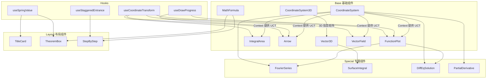

# 组件库设计总览

> 同济高数下册 Remotion 动画项目 — 组件目录

---

## 组件分类索引

| 文档 | 涵盖组件 | 说明 |
|------|----------|------|
| [base-components.md](./base-components.md) | `MathFormula`、`CoordinateSystem`、`CoordinateSystem3D`、`FunctionPlot`、`IntegralArea`、`Arrow`、`Vector3D`、`VectorField` | 基础渲染原子组件，无业务逻辑 |
| [layout-components.md](./layout-components.md) | `TitleCard`、`TheoremBox`、`StepByStep` | 教学布局组件，控制信息呈现结构 |
| [special-components.md](./special-components.md) | `FourierSeries`、`SurfaceIntegral`、`DiffEqSolution`、`PartialDerivative` | 专题可视化组件，为特定章节定制 |
| [hooks.md](./hooks.md) | `useCoordinateTransform`、`useDrawProgress`、`useSpringValue`、`useStaggeredEntrance` | 自定义 Hooks，封装动画与坐标逻辑 |

---

## 组件依赖关系图



---

## 设计原则

### 1. 原子化
每个基础组件只负责**单一视觉职责**：`MathFormula` 只渲染公式，`FunctionPlot` 只绘制曲线，不内嵌布局逻辑。

### 2. 坐标系解耦
`CoordinateSystem` 通过 **React Context** 向子组件注入坐标变换函数，子组件（`FunctionPlot`、`IntegralArea`、`Arrow`）无需接收 `xRange`/`yRange` 参数——当它们被放在 `CoordinateSystem` 内部时，自动感知坐标范围。

```jsx
// 正确用法：子组件自动继承坐标系
<CoordinateSystem xRange={[-5, 5]} yRange={[-3, 3]}>
  <FunctionPlot fn={Math.sin} color="#61dafb" drawProgress={0.7} />
  <IntegralArea fn={Math.sin} a={0} b={Math.PI} />
  <Arrow from={[0, 0]} to={[2, 1]} />
</CoordinateSystem>
```

### 3. 动画进度参数化
所有涉及入场动画的组件均通过**归一化进度值 [0, 1]** 控制显示状态，而非直接使用帧号。帧号到进度的转换由外层 Composition 或 Hook 完成：

```typescript
// Composition 中的典型用法
const frame = useCurrentFrame();
const drawProgress = interpolate(frame, [120, 200], [0, 1], {
  extrapolateRight: "clamp",
});
return <FunctionPlot fn={Math.sin} drawProgress={drawProgress} />;
```

### 4. 颜色统一
所有颜色参数默认值引用 `src/constants/colors.ts` 中的 `COLORS` 常量，保证视觉风格一致。

### 5. 纯 SVG 渲染
所有图形组件（坐标系、曲线、箭头）均输出 **SVG 元素**，不使用 Canvas 或 WebGL，确保 Remotion 服务端渲染（SSR）兼容性。

---

## 工具函数模块

| 文件 | 说明 |
|------|------|
| [`src/utils/mathUtils.ts`](../../src/utils/mathUtils.ts) | 数学计算工具：`generateFunctionPath()`、`clamp()`、`lerp()` |
| [`src/utils/pathUtils.ts`](../../src/utils/pathUtils.ts) | 坐标变换工厂：`createCoordinateTransform()` |
| [`src/utils/animationUtils.ts`](../../src/utils/animationUtils.ts) | **（2026-04-08 新增）** 公共动画辅助函数，供所有 Composition 共享 |

### `animationUtils.ts` 函数一览

> 文件路径：[`src/utils/animationUtils.ts`](../../src/utils/animationUtils.ts)  
> 用途：消除各 Composition 文件中重复定义的动画辅助函数，统一维护

| 函数 | 签名 | 说明 |
|------|------|------|
| [`fade()`](../../src/utils/animationUtils.ts) | `(frame, startFrame, endFrame) => number` | 基础淡入淡出，将帧号映射为 [0,1] 透明度，带双端 clamp |
| [`lerp()`](../../src/utils/animationUtils.ts) | `(a, b, t) => number` | 线性插值，`t=0` 返回 `a`，`t=1` 返回 `b` |
| [`isVisible()`](../../src/utils/animationUtils.ts) | `(frame, startFrame, endFrame) => boolean` | 判断当前帧是否在指定区间内 |
| [`stepOpacity()`](../../src/utils/animationUtils.ts) | `(progress, stepIndex, totalSteps) => number` | 按步骤数均分进度，返回指定步骤的透明度 |
| [`springFade()`](../../src/utils/animationUtils.ts) | `(frame, startFrame, duration) => number` | 带阻尼感的弹簧淡入（模拟轻微过冲缓动） |

```typescript
// 导入示例
import { fade, lerp, isVisible, stepOpacity, springFade } from "../../utils/animationUtils";

// 典型用法
const titleOpacity = fade(frame, 0, 30);          // 第0~30帧淡入
const pos = lerp(startX, endX, progress);          // 位置插值
const show = isVisible(frame, 60, 180);            // 第60~180帧可见
const step2Alpha = stepOpacity(progress, 1, 3);   // 三步推导中第2步的透明度
const heroOpacity = springFade(frame, 30, 45);    // 带弹簧感的淡入
```

---

## 文件位置速查

```
src/
├── utils/
│   ├── mathUtils.ts          # 数学计算工具
│   ├── pathUtils.ts          # 坐标变换工厂
│   └── animationUtils.ts     # 公共动画辅助函数（2026-04-08 新增）
└── components/
    ├── base/
    │   ├── MathFormula.tsx
    │   ├── CoordinateSystem.tsx
    │   ├── CoordinateSystem3D.tsx
    │   ├── FunctionPlot.tsx
    │   ├── IntegralArea.tsx      # 已在 Ch10/Sec01、Ch10/Sec04 中使用
    │   ├── Arrow.tsx
    │   ├── Vector3D.tsx
    │   └── VectorField.tsx
    ├── layout/
    │   ├── TitleCard.tsx
    │   ├── TheoremBox.tsx
    │   └── StepByStep.tsx
    └── special/
        ├── FourierSeries.tsx
        ├── SurfaceIntegral.tsx
        ├── DiffEqSolution.tsx
        └── PartialDerivative.tsx
```
