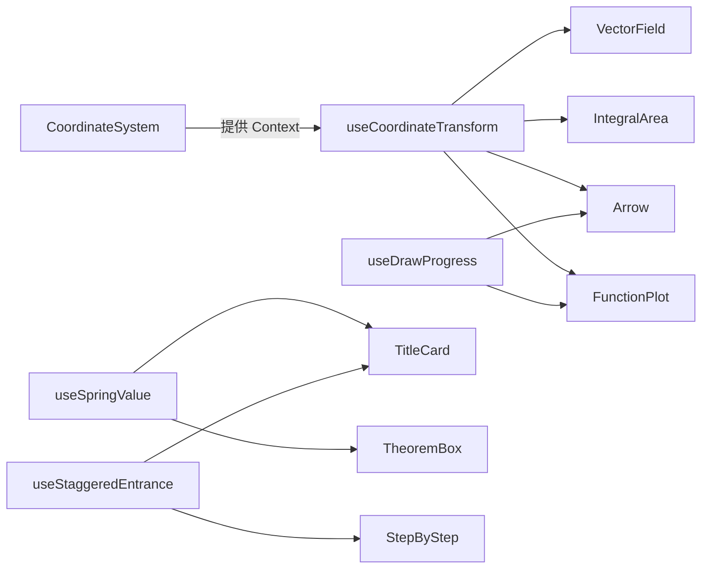

# 自定义 Hooks

> 文件路径：`src/hooks/`
> 封装 Remotion 帧驱动动画与坐标变换的复用逻辑，所有 Hook 均遵循 React Hooks 规则。

---

## useCoordinateTransform

**文件**：`src/hooks/useCoordinateTransform.ts`
**职责**：提供数学坐标与像素坐标之间的双向转换函数。可从 `CoordinateSystem` 的 React Context 中自动获取，也可直接传参调用（用于 Context 外部）。

### 类型定义

```typescript
interface CoordinateTransformOptions {
  /** 画布像素宽度 */
  width: number;
  /** 画布像素高度 */
  height: number;
  /** 数学 x 轴范围 [xMin, xMax] */
  xRange: [number, number];
  /** 数学 y 轴范围 [yMin, yMax] */
  yRange: [number, number];
}

interface CoordinateTransform {
  /** 数学坐标 → 像素坐标 */
  toPixel: (mathX: number, mathY: number) => [number, number];
  /** 像素坐标 → 数学坐标 */
  toMath: (pixelX: number, pixelY: number) => [number, number];
  /** 数学 x 长度 → 像素长度 */
  scaleX: (mathLength: number) => number;
  /** 数学 y 长度 → 像素长度 */
  scaleY: (mathLength: number) => number;
  /** 画布宽度（px） */
  width: number;
  /** 画布高度（px） */
  height: number;
  /** x 轴数学范围 */
  xRange: [number, number];
  /** y 轴数学范围 */
  yRange: [number, number];
}

/**
 * 从 CoordinateSystem Context 获取坐标变换（在 CoordinateSystem 子组件内使用）
 * 若不在 Context 内，则必须传入 options 参数
 */
function useCoordinateTransform(
  options?: CoordinateTransformOptions
): CoordinateTransform;
```

### 实现逻辑

```typescript
export function useCoordinateTransform(
  options?: CoordinateTransformOptions
): CoordinateTransform {
  // 优先从 Context 获取（在 CoordinateSystem 子组件内时）
  const ctx = useContext(CoordinateContext);
  const config = options ?? ctx;

  if (!config) {
    throw new Error(
      "useCoordinateTransform: 必须在 CoordinateSystem 内部使用，或者传入 options 参数"
    );
  }

  const { width, height, xRange, yRange } = config;
  const [xMin, xMax] = xRange;
  const [yMin, yMax] = yRange;

  return useMemo(() => ({
    toPixel: (mathX, mathY) => [
      ((mathX - xMin) / (xMax - xMin)) * width,
      height - ((mathY - yMin) / (yMax - yMin)) * height,
    ],
    toMath: (pixelX, pixelY) => [
      (pixelX / width) * (xMax - xMin) + xMin,
      ((height - pixelY) / height) * (yMax - yMin) + yMin,
    ],
    scaleX: (len) => (len / (xMax - xMin)) * width,
    scaleY: (len) => (len / (yMax - yMin)) * height,
    width,
    height,
    xRange,
    yRange,
  }), [width, height, xMin, xMax, yMin, yMax]);
}
```

### 使用示例

```typescript
// 在 CoordinateSystem 子组件内（自动从 Context 获取）
const MyPlot: React.FC<{ fn: (x: number) => number }> = ({ fn }) => {
  const { toPixel, xRange } = useCoordinateTransform();
  const [xMin, xMax] = xRange;

  const points = Array.from({ length: 200 }, (_, i) => {
    const mathX = xMin + (i / 199) * (xMax - xMin);
    const mathY = fn(mathX);
    return toPixel(mathX, mathY);
  });

  const d = points.map(([x, y], i) => `${i === 0 ? "M" : "L"}${x},${y}`).join(" ");
  return <path d={d} stroke="#61dafb" fill="none" strokeWidth={3} />;
};

// 在 CoordinateSystem 外部（传入参数）
const transform = useCoordinateTransform({
  width: 800, height: 600,
  xRange: [-5, 5], yRange: [-4, 4],
});
const [px, py] = transform.toPixel(2.5, -1.3);
```

---

## useDrawProgress

**文件**：`src/hooks/useDrawProgress.ts`
**职责**：基于 `stroke-dashoffset` 技术生成 SVG 路径描绘动画的进度值，配合 `pathLength={1}` 使用。

### 类型定义

```typescript
interface DrawProgressOptions {
  /** 动画起始帧（相对于 Composition 开始帧） */
  from: number;
  /** 动画持续帧数 */
  duration: number;
  /** 缓动函数，默认 Easing.bezier(0.4, 0, 0.2, 1)（Material Design 标准缓动） */
  easing?: (t: number) => number;
  /** 初始延迟帧数（在 from 之前保持 0），默认 0 */
  delay?: number;
}

interface DrawProgressResult {
  /** 当前描绘进度 [0, 1] */
  progress: number;
  /** SVG path 的 strokeDasharray 值（固定为 "1"，配合 pathLength） */
  strokeDasharray: string;
  /** SVG path 的 strokeDashoffset 值（1 - progress） */
  strokeDashoffset: number;
  /** 动画是否已完成（progress === 1） */
  isComplete: boolean;
}

function useDrawProgress(options: DrawProgressOptions): DrawProgressResult;
```

### 实现逻辑

```typescript
import { useCurrentFrame, interpolate, Easing } from "remotion";

export function useDrawProgress({
  from,
  duration,
  easing = Easing.bezier(0.4, 0, 0.2, 1),
  delay = 0,
}: DrawProgressOptions): DrawProgressResult {
  const frame = useCurrentFrame();

  const progress = interpolate(
    frame,
    [from + delay, from + delay + duration],
    [0, 1],
    {
      extrapolateLeft: "clamp",
      extrapolateRight: "clamp",
      easing,
    }
  );

  return {
    progress,
    strokeDasharray: "1",
    strokeDashoffset: 1 - progress,
    isComplete: progress >= 1,
  };
}
```

### 使用示例

```typescript
// FunctionPlot 内部使用
const MyFunctionPlot: React.FC<{ drawProgress?: number }> = ({ drawProgress = 1 }) => {
  // drawProgress 由外层传入（外层用 useDrawProgress 计算）
  return (
    <path
      d={pathData}
      pathLength={1}
      strokeDasharray="1"
      strokeDashoffset={1 - drawProgress}
      stroke="#61dafb"
      fill="none"
    />
  );
};

// 在 Composition 中驱动描绘动画
const MyComposition: React.FC = () => {
  const { progress } = useDrawProgress({ from: 120, duration: 90 });
  return (
    <CoordinateSystem>
      <FunctionPlot fn={Math.sin} drawProgress={progress} />
    </CoordinateSystem>
  );
};
```

---

## useSpringValue

**文件**：`src/hooks/useSpringValue.ts`
**职责**：封装 Remotion 的 `spring()` 函数，提供弹性（回弹）插值，用于元素的入场/弹出效果。

### 类型定义

```typescript
interface SpringValueOptions {
  /** 弹性动画起始帧 */
  from: number;
  /** 弹性强度（越大越硬），默认 200 */
  stiffness?: number;
  /** 阻尼系数（越大越快停止），默认 15 */
  damping?: number;
  /** 质量（影响惯性），默认 1 */
  mass?: number;
  /** 输出值范围 [outputMin, outputMax]，默认 [0, 1] */
  outputRange?: [number, number];
}

function useSpringValue(options: SpringValueOptions): number;
```

### 实现逻辑

```typescript
import { useCurrentFrame, spring, useVideoConfig } from "remotion";

export function useSpringValue({
  from,
  stiffness = 200,
  damping = 15,
  mass = 1,
  outputRange = [0, 1],
}: SpringValueOptions): number {
  const frame = useCurrentFrame();
  const { fps } = useVideoConfig();

  const raw = spring({
    frame: Math.max(0, frame - from),
    fps,
    config: { stiffness, damping, mass },
  });

  const [min, max] = outputRange;
  return min + raw * (max - min);
}
```

### 使用示例

```typescript
// TheoremBox 弹性入场
const TheoremBox: React.FC<TheoremBoxProps> = ({ enterProgress }) => {
  const scale = useSpringValue({
    from: 30,
    stiffness: 180,
    damping: 12,
    outputRange: [0.85, 1],
  });
  // 结合外部传入的 enterProgress 做透明度，spring 做缩放
  return (
    <div style={{ transform: `scale(${scale})`, opacity: enterProgress }}>
      {/* 内容 */}
    </div>
  );
};

// TitleCard 标题弹性上移
const titleY = useSpringValue({
  from: 15,
  stiffness: 150,
  damping: 14,
  outputRange: [30, 0], // 从 y+30 弹到 y+0
});
```

---

## useStaggeredEntrance

**文件**：`src/hooks/useStaggeredEntrance.ts`
**职责**：为一组元素生成错开（stagger）的入场进度数组，每个元素依次延迟显示。

### 类型定义

```typescript
interface StaggeredEntranceOptions {
  /** 元素总数量 */
  count: number;
  /** 整体入场起始帧 */
  from: number;
  /** 相邻元素入场的时间差（帧），默认 10 */
  staggerFrames?: number;
  /** 每个元素淡入持续帧数，默认 20 */
  itemDuration?: number;
  /** 缓动函数，默认 Easing.out(Easing.quad) */
  easing?: (t: number) => number;
}

/**
 * 返回每个元素当前的入场进度数组 [0, 1]
 * result[i] 表示第 i 个元素的显示进度
 */
function useStaggeredEntrance(options: StaggeredEntranceOptions): number[];
```

### 实现逻辑

```typescript
import { useCurrentFrame, interpolate, Easing } from "remotion";

export function useStaggeredEntrance({
  count,
  from,
  staggerFrames = 10,
  itemDuration = 20,
  easing = Easing.out(Easing.quad),
}: StaggeredEntranceOptions): number[] {
  const frame = useCurrentFrame();

  return Array.from({ length: count }, (_, i) => {
    const itemStart = from + i * staggerFrames;
    return interpolate(frame, [itemStart, itemStart + itemDuration], [0, 1], {
      extrapolateLeft: "clamp",
      extrapolateRight: "clamp",
      easing,
    });
  });
}
```

### 使用示例

```typescript
// TitleCard 中三层文字错开淡入
const TitleCard: React.FC<TitleCardProps> = ({ chapterLabel, title, subtitle }) => {
  const [labelProgress, titleProgress, subtitleProgress] = useStaggeredEntrance({
    count: 3,
    from: 0,
    staggerFrames: 15,
    itemDuration: 20,
  });

  return (
    <>
      <div style={{ opacity: labelProgress }}>{chapterLabel}</div>
      <div style={{ opacity: titleProgress }}>{title}</div>
      <div style={{ opacity: subtitleProgress }}>{subtitle}</div>
    </>
  );
};

// StepByStep 多步骤错开入场
const progresses = useStaggeredEntrance({
  count: steps.length,
  from: 120,
  staggerFrames: 30,  // 每步相差 30 帧（1 秒）
  itemDuration: 15,
});
```

---

## Hooks 使用关系总览



---

## 各 Hook 参数速查表

| Hook | 关键参数 | 返回值 | 主要消费组件 |
|------|----------|--------|-------------|
| `useCoordinateTransform` | `width, height, xRange, yRange` | `{toPixel, toMath, scaleX, scaleY}` | `FunctionPlot`, `IntegralArea`, `Arrow`, `VectorField` |
| `useDrawProgress` | `from, duration, easing` | `{progress, strokeDasharray, strokeDashoffset}` | `FunctionPlot`, `Arrow` |
| `useSpringValue` | `from, stiffness, damping, outputRange` | `number` | `TitleCard`, `TheoremBox` |
| `useStaggeredEntrance` | `count, from, staggerFrames, itemDuration` | `number[]` | `TitleCard`, `StepByStep` |
