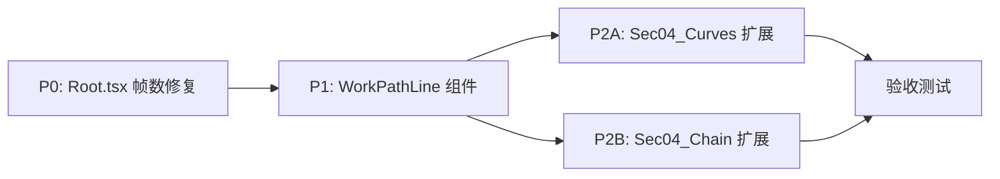

# 组件架构规划文档

**项目**：Remotion 高等数学教学动画  
**文档版本**：v1.0  
**日期**：2026-04-08  
**状态**：待实现（仅规划，不含代码修改）

---

## 目录

1. [问题1 — Root.tsx 帧数截断修复（P0）](#问题1--roottsx-帧数截断修复p0)
2. [问题2 — WorkPathLine 组件设计（P1）](#问题2--workpathline-组件设计p1)
3. [问题3A — Sec04_Curves 增强规格（P2）](#问题3a--sec04_curves-增强规格p2)
4. [问题3B — Sec04_Chain 增强规格（P2）](#问题3b--sec04_chain-增强规格p2)
5. [全局约束与注意事项](#全局约束与注意事项)

---

## 问题1 — Root.tsx 帧数截断修复（P0）

### 根因分析

[`src/Root.tsx`](../src/Root.tsx) 中以下 12 个 `<Composition>` 的 `durationInFrames` 被错误设置为 `300`，而对应源文件内容设计为 480 帧（5 个场景，每场景约 90 帧）。由于 Remotion 在渲染时严格按 `durationInFrames` 截断输出，导致最后 180 帧（约 6 秒，30fps）的动画内容永远不会被渲染或导出。

### 修改清单

| Composition id | 所在行（Root.tsx） | 当前值 | 目标值 |
|---|---|---|---|
| `Ch07-Sec03-Homogeneous` | ~100 | 300 | **480** |
| `Ch07-Sec05-Exact` | ~104 | 300 | **480** |
| `Ch07-Sec06-HighOrder` | ~106 | 300 | **480** |
| `Ch07-Sec07-Linear2` | ~108 | 300 | **480** |
| `Ch08-Sec03-Surfaces` | ~120 | 300 | **480** |
| `Ch09-Sec01-Concept` | ~130 | 300 | **480** |
| `Ch09-Sec03-Total` | ~134 | 300 | **480** |
| `Ch09-Sec05-Implicit` | ~138 | 300 | **480** |
| `Ch09-Sec06-Geometry` | ~140 | 300 | **480** |
| `Ch11-Sec04-Surface1` | ~后段 | 300 | **480** |
| `Ch11-Sec05-Surface2` | ~后段 | 300 | **480** |
| `Ch12-Sec05-Apps` | ~后段 | 300 | **480** |

> **说明**：`Ch08-Sec04-Curves`（第 122 行）和 `Ch09-Sec04-Chain`（第 136 行）当前也是 300，但这两个文件将在问题 3 中整体重写扩展到 480 帧，届时一并修改。

### 修改代码模式

每处修改均为单行替换，模式如下：

```tsx
// Before（以 Ch07-Sec03-Homogeneous 为例）
<Composition id="Ch07-Sec03-Homogeneous" component={Sec03Homogeneous}
  durationInFrames={300} fps={VIDEO_CONFIG.fps} width={VIDEO_CONFIG.width} height={VIDEO_CONFIG.height} />

// After
<Composition id="Ch07-Sec03-Homogeneous" component={Sec03Homogeneous}
  durationInFrames={480} fps={VIDEO_CONFIG.fps} width={VIDEO_CONFIG.width} height={VIDEO_CONFIG.height} />
```

### 验证方式

修改后在 Remotion Studio 中依次检查每个 Composition：
1. 进度条总长度应从 300 变为 480 帧
2. 将进度条拖至第 301 帧，应看到第 5 场景内容（而非最后一帧静止画面）
3. 拖至第 479 帧，内容应完整渲染

---

## 问题2 — WorkPathLine 组件设计（P1）

### 问题定位

**文件**：[`src/compositions/Ch11_LineAndSurface/Sec02_Line2.tsx`](../src/compositions/Ch11_LineAndSurface/Sec02_Line2.tsx)  
**位置**：第 124–136 行（Scene 2 内的 CoordinateSystem 子内容）

```tsx
// ❌ 死代码：IIFE 内无法调用 React Hook
{s2PathOp > 0.3 && (() => {
  const N = 40;
  const pts: string[] = [];
  for (let i = 0; i <= N; i++) {
    const t = i / N;
    const x = -1 + 2 * t;
    const y = -0.5 + t;
    // toPixel() 无法在此调用 —— useCoordContext() 违反 Hook 规则
    void x; void y;
  }
  return null;  // 路径永远不绘制
})()}
```

**根因**：[`useCoordContext()`](../src/components/math/CoordinateSystem.tsx:17) 是 React Hook（基于 `useContext`），只能在 React 函数组件顶层调用，不能在 IIFE、普通函数、条件语句内部调用，违反 [Rules of Hooks](https://react.dev/reference/rules/rules-of-hooks)。

### 解决方案：提取 `WorkPathLine` 组件

#### 放置位置决策

**推荐：局部组件，定义于 `Sec02_Line2.tsx` 文件顶部（`Sec02Line2` 主组件之前）**

```
src/compositions/Ch11_LineAndSurface/Sec02_Line2.tsx
  ├── const fade = ...
  ├── const UpperSemicircle: React.FC = ...  （已有局部组件）
  ├── const WorkPathLine: React.FC = ...      ← 新增局部组件
  └── const Sec02Line2: React.FC = ...        （主组件）
```

理由：
- 该路径（从 `(-1,-0.5)` 到 `(1,0.5)` 的直线段）是本节特定的教学内容，不具备跨文件复用价值
- 与现有 `UpperSemicircle` 局部组件保持一致的组织风格
- 若将来确有"在坐标系内绘制任意多段线"的复用需求，可届时迁移至 `src/components/math/PathLine.tsx`

#### Props 接口定义（TypeScript）

```typescript
/** 在 CoordinateSystem 内绘制一条分段路径（支持动画进度） */
interface WorkPathLineProps {
  /** 路径控制点，数学坐标系 [x, y] */
  points: Array<[number, number]>;
  /** 绘制进度 0~1，支持路径生长动画；默认 1（全部绘出） */
  progress?: number;
  /** 整体 SVG opacity；默认 1 */
  opacity?: number;
  /** 线条颜色；默认 COLORS.secondaryCurve */
  color?: string;
  /** 线条粗细（SVG strokeWidth）；默认 3 */
  strokeWidth?: number;
  /** 是否在路径中点处显示方向箭头；默认 false */
  showArrow?: boolean;
  /** 箭头颜色（未指定时与 color 一致） */
  arrowColor?: string;
}
```

#### 组件骨架代码

```tsx
/**
 * WorkPathLine
 * 在 CoordinateSystem 内绘制一条动画路径（直线或折线）。
 *
 * ⚠️ 约束：必须作为 <CoordinateSystem> 的直接或间接子组件使用，
 *    因为它依赖 CoordContext（通过 useCoordContext() 获取 toPixel 函数）。
 */
const WorkPathLine: React.FC<WorkPathLineProps> = ({
  points,
  progress = 1,
  opacity = 1,
  color = COLORS.secondaryCurve,
  strokeWidth = 3,
  showArrow = false,
  arrowColor,
}) => {
  // ✅ 合法 Hook 调用：在 React 函数组件顶层
  const { toPixel } = useCoordContext();

  const effectiveArrowColor = arrowColor ?? color;

  // 按 progress 截取可见点数
  const drawnCount = Math.max(1, Math.round(progress * points.length));
  const visiblePoints = points.slice(0, drawnCount);

  // 将数学坐标转换为 SVG path 指令
  const pathD = visiblePoints
    .map(([x, y], i) => {
      const { px, py } = toPixel(x, y);
      return `${i === 0 ? "M" : "L"}${px.toFixed(2)},${py.toFixed(2)}`;
    })
    .join(" ");

  // 方向箭头：取路径中点处的切线方向（仅在绘制超过 2 点时显示）
  const arrowElem =
    showArrow && drawnCount >= 2
      ? (() => {
          const midIdx = Math.floor(drawnCount / 2);
          const [x0, y0] = points[midIdx - 1];
          const [x1, y1] = points[midIdx];
          const { px: ax0, py: ay0 } = toPixel(x0, y0);
          const { px: ax1, py: ay1 } = toPixel(x1, y1);
          const angle =
            Math.atan2(ay1 - ay0, ax1 - ax0) * (180 / Math.PI);
          return (
            <polygon
              // 箭头三角形，原点在 (0,0)，尖端朝右，旋转后平移至中点
              points="-10,-5 0,0 -10,5"
              fill={effectiveArrowColor}
              transform={`translate(${ax1.toFixed(2)},${ay1.toFixed(2)}) rotate(${angle.toFixed(2)})`}
            />
          );
        })()
      : null;

  if (visiblePoints.length < 1) return null;

  return (
    <g opacity={opacity}>
      <path
        d={pathD}
        fill="none"
        stroke={color}
        strokeWidth={strokeWidth}
        strokeLinecap="round"
        strokeLinejoin="round"
      />
      {arrowElem}
    </g>
  );
};
```

#### 调用方修改方案（替换死代码）

在主组件 `Sec02Line2` 顶层预计算路径点（**不依赖 Hook，可安全放在顶层**）：

```tsx
const Sec02Line2: React.FC = () => {
  const frame = useCurrentFrame();

  // --- 预计算路径点（顶层，无 Hook 依赖） ---
  const workLinePath: Array<[number, number]> = React.useMemo(() => {
    const N = 40;
    const pts: Array<[number, number]> = [];
    for (let i = 0; i <= N; i++) {
      const t = i / N;
      pts.push([-1 + 2 * t, -0.5 + t]);
    }
    return pts;
  }, []); // 路径点固定，只计算一次

  // ... 其他帧变量 ...

  return (
    // ...
    <CoordinateSystem width={640} height={360} xRange={[-2, 2]} yRange={[-1.5, 1.5]} opacity={s2CoordOp}>
      <VectorField
        Px={(_x, _y) => 0.5}
        Py={(x, _y) => -0.3 * x}
        gridCount={7}
        scale={0.4}
        color={COLORS.vector}
        opacity={s2FieldOp * 0.7}
      />
      {/* ✅ 替换原 IIFE 死代码 */}
      <WorkPathLine
        points={workLinePath}
        progress={s2PathOp}
        opacity={s2PathOp}
        color={COLORS.secondaryCurve}
        strokeWidth={3}
        showArrow={true}
      />
    </CoordinateSystem>
    // ...
  );
};
```

#### 关键约束汇总

| 约束 | 说明 |
|---|---|
| **React Hook 规则** | `useCoordContext()` 必须在函数组件顶层调用；`WorkPathLine` 作为 React FC 满足此要求 |
| **Context 层级** | `WorkPathLine` 必须是 `<CoordinateSystem>` 的子孙节点；否则 `useCoordContext()` 将抛出 `"useCoordContext must be used inside CoordinateSystem"` 错误 |
| **路径点预计算** | `workLinePath` 应使用 `React.useMemo` 在父组件顶层预先构建，避免每帧重建数组 |
| **SVG 坐标** | `WorkPathLine` 内部已通过 `toPixel()` 做数学坐标→SVG 像素坐标转换，外部无需额外变换 |
| **条件渲染** | `s2PathOp > 0.3` 的条件渲染逻辑可保留在父组件 JSX 层，通过 `opacity` prop 控制即可，无需在 `WorkPathLine` 内部处理 |

---

## 问题3A — Sec04_Curves 增强规格（P2）

### 目标

**文件**：[`src/compositions/Ch08_VectorGeometry/Sec04_Curves.tsx`](../src/compositions/Ch08_VectorGeometry/Sec04_Curves.tsx)  
**当前**：3 场景 / 169 行 / ~300 帧  
**目标**：5 场景 / ~350 行 / 480 帧  
**Root.tsx 同步**：`Ch08-Sec04-Curves` 的 `durationInFrames` 从 300 改为 **480**

### 帧时序总览

```
帧范围        场景   内容
0   – 89    S1    标题卡 + 空间曲线概念引入
90  – 179   S2    螺旋线 x-z 截面动画（保留并优化现有实现）
180 – 269   S3    切线向量动画（Arrow 组件）
270 – 389   S4    参数方程组逐步展示 + 三轴坐标投影示意
390 – 479   S5    综合例题：柱面 x²+y²=1 与平面 z=y 的交线
```

### Scene 1（帧 0–89）：标题卡 + 概念引入

**复用组件**：[`TitleCard`](../src/components/ui/TitleCard.tsx)

```tsx
// 帧变量
const s1TitleOp = fade(frame, 0, 30);
const s1DefOp   = fade(frame, 45, 20);

// 渲染
<Sequence from={0} durationInFrames={90}>
  {/* 0-60: 标题卡 */}
  {frame < 60 && (
    <TitleCard
      chapterNum="八"
      chapterTitle="空间解析几何与向量代数"
      sectionNum="8.4"
      sectionTitle="空间曲线及其方程"
      opacity={s1TitleOp}
    />
  )}
  {/* 60-89: 概念定义 */}
  {frame >= 60 && (
    <AbsoluteFill style={{ justifyContent: "center", alignItems: "center", flexDirection: "column", gap: 24 }}>
      <div style={{ opacity: s1DefOp, color: COLORS.primaryCurve, fontSize: 28 }}>
        空间曲线 = 两曲面的交线
      </div>
      <MathFormula
        latex="\Gamma:\;\begin{cases} F(x,y,z)=0 \\ G(x,y,z)=0 \end{cases}"
        fontSize={40}
        color={COLORS.formula}
        opacity={s1DefOp}
      />
    </AbsoluteFill>
  )}
</Sequence>
```

### Scene 2（帧 90–179）：螺旋线 x-z 截面动画

**保留现有实现**，仅调整帧范围从 `[60,180]` 改为 `[90,180]`。

关键帧变量重新对齐：
```tsx
// 螺旋线绘制进度：在 Scene 2 开始后约 20 帧启动
const helixProgress = interpolate(frame, [110, 170], [0, 1], {
  extrapolateLeft: "clamp",
  extrapolateRight: "clamp",
});
```

### Scene 3（帧 180–269）：切线向量动画

**新增场景**，使用 [`Arrow`](../src/components/math/Arrow.tsx) 和 [`CoordinateSystem`](../src/components/math/CoordinateSystem.tsx) 组件。

**数学逻辑**：螺旋线切线方向向量 `r'(t) = (-sin t, cos t, b)`，在 x-y 投影面表现为单位圆切线。

```tsx
// 帧变量
const s3TitleOp  = fade(frame, 180, 20);
const s3CurveOp  = fade(frame, 198, 20);
const s3ArrowOp  = fade(frame, 220, 20);
const s3FormulaOp = fade(frame, 245, 20);

// 动画参数 t（切点在曲线上的参数）
const t_anim = interpolate(frame, [210, 265], [0, Math.PI * 1.5], {
  extrapolateLeft: "clamp",
  extrapolateRight: "clamp",
});

// 切点坐标（x-y 投影圆）
const tangentPtX = Math.cos(t_anim);
const tangentPtY = Math.sin(t_anim);
// 切线方向向量
const tangentDirX = -Math.sin(t_anim) * 0.5; // 缩放显示
const tangentDirY =  Math.cos(t_anim) * 0.5;
```

**渲染结构**：

```tsx
<Sequence from={180} durationInFrames={90}>
  <AbsoluteFill style={{ flexDirection: "column", alignItems: "center", gap: 16 }}>
    <div style={{ opacity: s3TitleOp, color: COLORS.highlight, fontSize: 26 }}>
      切线方向向量 r&#39;(t) = (-sin t, cos t, b)
    </div>

    {/* 使用 CoordinateSystem 展示 x-y 投影圆 + 切线箭头 */}
    <CoordinateSystem
      width={480}
      height={480}
      xRange={[-1.8, 1.8]}
      yRange={[-1.8, 1.8]}
      opacity={s3CurveOp}
    >
      {/* 单位圆（x-y 投影） */}
      <UnitCirclePath opacity={s3CurveOp} />

      {/* 切线箭头：随 t_anim 旋转 */}
      <Arrow
        fromX={tangentPtX}
        fromY={tangentPtY}
        toX={tangentPtX + tangentDirX}
        toY={tangentPtY + tangentDirY}
        color={COLORS.vector}
        label="r'(t)"
        opacity={s3ArrowOp}
      />

      {/* 切点标记 */}
      <TangentPointDot x={tangentPtX} y={tangentPtY} opacity={s3ArrowOp} />
    </CoordinateSystem>

    {/* 切线公式 */}
    <div style={{ opacity: s3FormulaOp }}>
      <MathFormula
        latex="\vec{r}'(t) = (-\sin t,\;\cos t,\;b)"
        fontSize={38}
        color={COLORS.formula}
      />
    </div>
  </AbsoluteFill>
</Sequence>
```

> **局部辅助组件**（在文件顶部定义，使用 `useCoordContext()`）：
> - `UnitCirclePath`：绘制单位圆 SVG path
> - `TangentPointDot`：绘制切点小圆点

### Scene 4（帧 270–389）：参数方程逐步展示 + 坐标投影

**使用组件**：[`MathFormula`](../src/components/math/MathFormula.tsx)、[`TheoremBox`](../src/components/ui/TheoremBox.tsx)

```tsx
// 帧变量（逐行揭示参数方程）
const s4TitleOp = fade(frame, 270, 20);
const s4Eq1Op   = fade(frame, 295, 20);  // x = cos t
const s4Eq2Op   = fade(frame, 320, 20);  // y = sin t
const s4Eq3Op   = fade(frame, 345, 20);  // z = t/(2π)
const s4ProjOp  = fade(frame, 368, 20);  // 投影说明
```

**布局**：左侧逐步显示参数方程三行，右侧展示三个坐标轴的投影描述。

```tsx
<Sequence from={270} durationInFrames={120}>
  <AbsoluteFill style={{ flexDirection: "row", alignItems: "center", gap: 60, padding: "0 80px" }}>
    {/* 左：参数方程逐步展示 */}
    <div style={{ flex: 1, display: "flex", flexDirection: "column", gap: 20 }}>
      <div style={{ opacity: s4TitleOp, color: COLORS.primaryCurve, fontSize: 26 }}>
        螺旋线参数方程（逐步展开）
      </div>
      <div style={{ opacity: s4Eq1Op }}>
        <MathFormula latex="x = a\cos t" fontSize={40} color={COLORS.formula} />
      </div>
      <div style={{ opacity: s4Eq2Op }}>
        <MathFormula latex="y = a\sin t" fontSize={40} color={COLORS.formula} />
      </div>
      <div style={{ opacity: s4Eq3Op }}>
        <MathFormula latex="z = bt" fontSize={40} color={COLORS.formula} />
      </div>
    </div>

    {/* 右：投影关系 */}
    <div style={{ flex: 1, opacity: s4ProjOp }}>
      <TheoremBox title="坐标轴投影" opacity={s4ProjOp} width={480}>
        <div style={{ fontSize: 20, lineHeight: 2, color: COLORS.formula }}>
          <div>xOy 面：x² + y² = a²（圆）</div>
          <div>xOz 面：x = a cos(z/b)（余弦曲线）</div>
          <div>yOz 面：y = a sin(z/b)（正弦曲线）</div>
        </div>
      </TheoremBox>
    </div>
  </AbsoluteFill>
</Sequence>
```

### Scene 5（帧 390–479）：综合例题

**例题**：柱面 x²+y²=1 与平面 z=y 的交线（椭圆螺旋线特例）

```tsx
// 帧变量
const s5TitleOp   = fade(frame, 390, 25);
const s5Step1Op   = fade(frame, 418, 20);  // 参数化 x=cos t, y=sin t
const s5Step2Op   = fade(frame, 440, 20);  // 代入 z=y=sin t
const s5ResultOp  = fade(frame, 462, 18);  // 结论

// 渲染
<Sequence from={390} durationInFrames={90}>
  <AbsoluteFill style={{ flexDirection: "column", alignItems: "center", gap: 28, padding: "0 100px" }}>
    <div style={{ opacity: s5TitleOp, color: COLORS.highlight, fontSize: 24 }}>
      例题：求柱面 x²+y²=1 与平面 z=y 的交线参数方程
    </div>
    <div style={{ opacity: s5Step1Op }}>
      <MathFormula
        latex="\text{令 } x = \cos t,\; y = \sin t \;\text{（柱面参数化）}"
        fontSize={32}
        color={COLORS.formula}
      />
    </div>
    <div style={{ opacity: s5Step2Op }}>
      <MathFormula
        latex="z = y = \sin t"
        fontSize={36}
        color={COLORS.secondaryCurve}
      />
    </div>
    <div style={{
      opacity: s5ResultOp,
      border: `2px solid ${COLORS.highlight}`,
      borderRadius: 12,
      padding: "12px 32px"
    }}>
      <MathFormula
        latex="\Gamma:\;\begin{cases} x=\cos t \\ y=\sin t \\ z=\sin t \end{cases}\;(t\in[0,2\pi])"
        fontSize={38}
        color={COLORS.highlight}
      />
    </div>
  </AbsoluteFill>
</Sequence>
```

### 新增局部辅助组件规格

以下两个局部组件需在文件顶部定义（在 `Sec04Curves` 主组件之前），均使用 `useCoordContext()`：

#### `UnitCirclePath`

```typescript
interface UnitCircleCProps {
  opacity?: number;
  color?: string;
  N?: number; // 采样点数，默认 120
}
```

渲染逻辑：在 CoordContext 内绘制单位圆（100% progress，纯展示）。

#### `TangentPointDot`

```typescript
interface TangentPointDotProps {
  x: number;   // 数学坐标 x
  y: number;   // 数学坐标 y
  opacity?: number;
  color?: string;
  r?: number;  // 像素半径，默认 6
}
```

渲染逻辑：调用 `toPixel(x, y)` 后绘制 SVG `<circle>`。

### 完整帧变量清单

```tsx
// Scene 1
const s1TitleOp   = fade(frame, 0, 30);
const s1DefOp     = fade(frame, 45, 20);

// Scene 2（保留，帧范围平移到 90-179）
const s2TitleOp   = fade(frame, 90, 20);
const helixProgress = interpolate(frame, [110, 170], [0, 1], { extrapolateLeft: "clamp", extrapolateRight: "clamp" });
const s2FormulaOp = fade(frame, 155, 20);

// Scene 3
const s3TitleOp   = fade(frame, 180, 20);
const s3CurveOp   = fade(frame, 198, 20);
const s3ArrowOp   = fade(frame, 220, 20);
const s3FormulaOp = fade(frame, 245, 20);
const t_anim      = interpolate(frame, [210, 265], [0, Math.PI * 1.5], { extrapolateLeft: "clamp", extrapolateRight: "clamp" });

// Scene 4
const s4TitleOp   = fade(frame, 270, 20);
const s4Eq1Op     = fade(frame, 295, 20);
const s4Eq2Op     = fade(frame, 320, 20);
const s4Eq3Op     = fade(frame, 345, 20);
const s4ProjOp    = fade(frame, 368, 20);

// Scene 5
const s5TitleOp   = fade(frame, 390, 25);
const s5Step1Op   = fade(frame, 418, 20);
const s5Step2Op   = fade(frame, 440, 20);
const s5ResultOp  = fade(frame, 462, 18);
```

---

## 问题3B — Sec04_Chain 增强规格（P2）

### 目标

**文件**：[`src/compositions/Ch09_MultiVariable/Sec04_Chain.tsx`](../src/compositions/Ch09_MultiVariable/Sec04_Chain.tsx)  
**当前**：3 场景 / 179 行 / ~300 帧  
**目标**：5 场景 / ~380 行 / 480 帧  
**Root.tsx 同步**：`Ch09-Sec04-Chain` 的 `durationInFrames` 从 300 改为 **480**

### 帧时序总览

```
帧范围        场景   内容
0   – 89    S1    标题卡 + 链式法则定义
90  – 179   S2    树状图（保留并增强：逐步揭示连线）
180 – 269   S3    公式推导（保留现有 TheoremBox 内容）
270 – 389   S4    具体例题动画化推导 z = f(x²+y², xy)
390 – 479   S5    全微分形式不变性与链式法则对比
```

### Scene 1（帧 0–89）：标题卡 + 定义

**复用**：[`TitleCard`](../src/components/ui/TitleCard.tsx)（保留现有实现，帧范围 0–60）

新增 60–89 帧：渐入复合关系示意文字。

```tsx
const s1TitleOp = fade(frame, 0, 30);
const s1DefOp   = fade(frame, 65, 20);

// 60-89 帧新内容
{frame >= 60 && frame < 90 && (
  <AbsoluteFill style={{ justifyContent: "center", alignItems: "center", flexDirection: "column", gap: 20 }}>
    <div style={{ opacity: s1DefOp, color: COLORS.primaryCurve, fontSize: 26 }}>
      复合关系：z = f(u, v)，u = u(x,y)，v = v(x,y)
    </div>
    <MathFormula
      latex="\frac{\partial z}{\partial x} = \frac{\partial z}{\partial u}\cdot\frac{\partial u}{\partial x} + \frac{\partial z}{\partial v}\cdot\frac{\partial v}{\partial x}"
      fontSize={38}
      color={COLORS.formula}
      opacity={s1DefOp}
    />
  </AbsoluteFill>
)}
```

### Scene 2（帧 90–179）：树状图（逐步揭示）

**增强现有实现**：原树状图是整体一次性出现（`treeOpacity = fade(frame, 80, 30)`），改为节点和连线**分层逐步揭示**。

```tsx
// 新的逐步揭示时序
const s2ZNodeOp    = fade(frame, 90, 20);   // z 节点
const s2UVNodeOp   = fade(frame, 110, 20);  // u, v 节点
const s2ZULineOp   = fade(frame, 120, 15);  // z→u 连线 + 标注
const s2ZVLineOp   = fade(frame, 125, 15);  // z→v 连线 + 标注
const s2XYUNodeOp  = fade(frame, 135, 20);  // u 下的 x, y 节点
const s2XYVNodeOp  = fade(frame, 140, 20);  // v 下的 x, y 节点
const s2XULineOp   = fade(frame, 148, 15);  // u→x 连线
const s2YULineOp   = fade(frame, 153, 15);  // u→y 连线
const s2XVLineOp   = fade(frame, 158, 15);  // v→x 连线
const s2YVLineOp   = fade(frame, 163, 15);  // v→y 连线
const s2FormulaOp  = fade(frame, 155, 20);  // 右侧配套公式
```

SVG 树状图各元素分别受对应 opacity 控制，实现从上到下的"树状生长"动画。

**注意**：现有树状图 SVG 代码（约第 90–132 行）结构良好，只需为每个 `<circle>`、`<line>`、`<text>` 添加 `opacity` 属性即可。

### Scene 3（帧 180–269）：公式推导

**保留现有 TheoremBox 内容**，帧范围从 `[180,300]` 调整为 `[180,270]`，并压缩揭示时序：

```tsx
// 原时序（相对帧）压缩到 90 帧内
const s3Thm1Op = fade(frame, 185, 20);
const s3Thm2Op = fade(frame, 210, 20);
const s3Thm3Op = fade(frame, 240, 20);
const s3ExOp   = fade(frame, 255, 15);
```

### Scene 4（帧 270–389）：具体例题动画化推导

**新增场景**，展示 `z = f(x²+y², xy)` 的链式法则推导。

**数学内容**：令 `u = x²+y²`，`v = xy`，则：
- `∂z/∂x = f₁' · 2x + f₂' · y`
- `∂z/∂y = f₁' · 2y + f₂' · x`

```tsx
// 帧变量（逐步推导）
const s4TitleOp   = fade(frame, 270, 20);
const s4Setup1Op  = fade(frame, 293, 20);  // 令 u = x²+y²
const s4Setup2Op  = fade(frame, 316, 20);  // 令 v = xy
const s4Deriv1Op  = fade(frame, 340, 20);  // ∂u/∂x=2x, ∂u/∂y=2y
const s4Deriv2Op  = fade(frame, 356, 20);  // ∂v/∂x=y,  ∂v/∂y=x
const s4Chain1Op  = fade(frame, 370, 18);  // 代入链式法则
const s4ResultOp  = fade(frame, 382, 15);  // 最终结果高亮
```

**渲染结构**：

```tsx
<Sequence from={270} durationInFrames={120}>
  <AbsoluteFill style={{ flexDirection: "column", alignItems: "center", gap: 18, padding: "0 100px" }}>
    <div style={{ opacity: s4TitleOp, color: COLORS.highlight, fontSize: 24 }}>
      例题：z = f(x²+y², xy)，求 ∂z/∂x
    </div>

    {/* 步骤1：令中间变量 */}
    <div style={{ opacity: s4Setup1Op }}>
      <MathFormula latex="u = x^2+y^2 \implies \frac{\partial u}{\partial x}=2x" fontSize={32} color={COLORS.formula} />
    </div>
    <div style={{ opacity: s4Setup2Op }}>
      <MathFormula latex="v = xy \implies \frac{\partial v}{\partial x}=y" fontSize={32} color={COLORS.formula} />
    </div>

    {/* 步骤2：代入链式法则 */}
    <div style={{ opacity: s4Chain1Op }}>
      <MathFormula
        latex="\frac{\partial z}{\partial x} = f_1' \cdot 2x + f_2' \cdot y"
        fontSize={38}
        color={COLORS.secondaryCurve}
      />
    </div>

    {/* 结果 */}
    <div style={{
      opacity: s4ResultOp,
      border: `2px solid ${COLORS.highlight}`,
      borderRadius: 10,
      padding: "10px 28px"
    }}>
      <MathFormula
        latex="\frac{\partial z}{\partial x} = 2x f_1'(u,v) + y f_2'(u,v)"
        fontSize={40}
        color={COLORS.highlight}
      />
    </div>
  </AbsoluteFill>
</Sequence>
```

### Scene 5（帧 390–479）：全微分形式不变性对比

**新增场景**，对比链式法则与全微分形式不变性。

**数学内容**：  
全微分形式：`dz = (∂z/∂u)du + (∂z/∂v)dv`（无论 u, v 是自变量还是中间变量，形式相同）

```tsx
// 帧变量
const s5TitleOp    = fade(frame, 390, 25);
const s5DiffOp     = fade(frame, 415, 20);  // 全微分公式
const s5ChainOp    = fade(frame, 438, 20);  // 链式法则公式
const s5ArrowOp    = fade(frame, 455, 20);  // 对比箭头/等号
const s5SummaryOp  = fade(frame, 465, 18); // 总结文字
```

**渲染结构**：

```tsx
<Sequence from={390} durationInFrames={90}>
  <AbsoluteFill style={{ flexDirection: "column", alignItems: "center", gap: 28, padding: "0 100px" }}>
    <div style={{ opacity: s5TitleOp, color: COLORS.secondaryCurve, fontSize: 26 }}>
      全微分形式不变性
    </div>

    {/* 全微分形式 */}
    <div style={{ opacity: s5DiffOp }}>
      <MathFormula
        latex="\mathrm{d}z = \frac{\partial z}{\partial u}\mathrm{d}u + \frac{\partial z}{\partial v}\mathrm{d}v"
        fontSize={40}
        color={COLORS.formula}
      />
    </div>

    {/* 等价提示 */}
    <div style={{ opacity: s5ArrowOp, color: COLORS.vector, fontSize: 22 }}>
      ⟺ 无论 u, v 是自变量还是 x, y 的函数，形式相同
    </div>

    {/* 与链式法则的等价性 */}
    <div style={{ opacity: s5ChainOp }}>
      <MathFormula
        latex="\frac{\partial z}{\partial x} = \frac{\partial z}{\partial u}\cdot\frac{\partial u}{\partial x} + \frac{\partial z}{\partial v}\cdot\frac{\partial v}{\partial x}"
        fontSize={36}
        color={COLORS.primaryCurve}
      />
    </div>

    {/* 总结 */}
    <div style={{ opacity: s5SummaryOp, color: COLORS.annotation, fontSize: 20, textAlign: "center" }}>
      链式法则是全微分形式不变性在具体变量下的展开
    </div>
  </AbsoluteFill>
</Sequence>
```

### 完整帧变量清单

```tsx
// Scene 1
const s1TitleOp   = fade(frame, 0, 30);
const s1DefOp     = fade(frame, 65, 20);

// Scene 2（树状图逐步揭示）
const s2ZNodeOp   = fade(frame, 90, 20);
const s2UVNodeOp  = fade(frame, 110, 20);
const s2ZULineOp  = fade(frame, 120, 15);
const s2ZVLineOp  = fade(frame, 125, 15);
const s2XYUOp     = fade(frame, 135, 20);
const s2XYVOp     = fade(frame, 140, 20);
const s2ULineOp   = fade(frame, 148, 15);
const s2VLineOp   = fade(frame, 158, 15);
const s2FormulaOp = fade(frame, 155, 20);

// Scene 3（公式推导压缩版）
const s3Thm1Op    = fade(frame, 185, 20);
const s3Thm2Op    = fade(frame, 210, 20);
const s3Thm3Op    = fade(frame, 240, 20);
const s3ExOp      = fade(frame, 255, 15);

// Scene 4（例题推导）
const s4TitleOp   = fade(frame, 270, 20);
const s4Setup1Op  = fade(frame, 293, 20);
const s4Setup2Op  = fade(frame, 316, 20);
const s4Chain1Op  = fade(frame, 340, 20);
const s4ResultOp  = fade(frame, 370, 18);

// Scene 5（全微分对比）
const s5TitleOp   = fade(frame, 390, 25);
const s5DiffOp    = fade(frame, 415, 20);
const s5ArrowOp   = fade(frame, 438, 20);
const s5ChainOp   = fade(frame, 450, 20);
const s5SummaryOp = fade(frame, 465, 18);
```

---

## 全局约束与注意事项

### React Hook 规则（所有新组件必须遵守）

```
✅ 合法调用位置：
  - React 函数组件顶层
  - 自定义 Hook 内部

❌ 禁止调用位置：
  - 普通函数 / IIFE 内部
  - 条件语句（if/else）内部
  - 循环（for/while）内部
  - 事件处理函数内部
```

**具体到本项目**：`useCoordContext()`、`useCurrentFrame()`、`interpolate()`（非 Hook，但建议统一在顶层调用）都应在函数组件最顶层声明。

### Remotion 帧时序约束

| 约束 | 规则 |
|---|---|
| **帧边界** | `durationInFrames` 必须与组件内实际场景总帧数一致，否则内容截断或空帧 |
| **interpolate clamp** | 所有 `interpolate` 调用必须设置 `extrapolateLeft: "clamp"` 和 `extrapolateRight: "clamp"`，防止帧超出范围时值溢出 |
| **fade 函数** | 项目统一使用 `fade(frame, start, duration = 30)` 模式，返回 `[0,1]` 淡入值 |
| **Sequence 范围** | `<Sequence from={X} durationInFrames={Y}>` 中，子组件在帧 `[X, X+Y)` 内渲染，frame 从 0 重计数 |

### 现有组件 API 速查

| 组件 | 文件 | 关键 Props |
|---|---|---|
| `TitleCard` | `src/components/ui/TitleCard.tsx` | `chapterNum`, `chapterTitle`, `sectionNum`, `sectionTitle`, `opacity` |
| `TheoremBox` | `src/components/ui/TheoremBox.tsx` | `title`, `opacity`, `width`, `children` |
| `MathFormula` | `src/components/math/MathFormula.tsx` | `latex`, `fontSize`, `color`, `opacity` |
| `CoordinateSystem` | `src/components/math/CoordinateSystem.tsx` | `width`, `height`, `xRange`, `yRange`, `showGrid`, `opacity`, `children` |
| `Arrow` | `src/components/math/Arrow.tsx` | `fromX`, `fromY`, `toX`, `toY`, `color`, `label`, `opacity` |
| `VectorField` | `src/components/math/VectorField.tsx` | `Px`, `Py`, `gridCount`, `scale`, `color`, `opacity` |
| `useCoordContext` | `src/components/math/CoordinateSystem.tsx:17` | 返回 `{ toPixel, toMath, svgWidth, svgHeight, xRange, yRange }` |

### 实现顺序建议



1. **先修 P0**（Root.tsx 12 处帧数）：改动小、风险低、立即可验收
2. **再修 P1**（WorkPathLine）：修复渲染缺失的路径，逻辑独立
3. **最后 P2**（两文件扩展）：改动最大，建议分文件单独提交

---

*文档作者：Architect 模式（Roo）*  
*对应源码仓库路径：`/Users/zsk/Downloads/code/math`*
