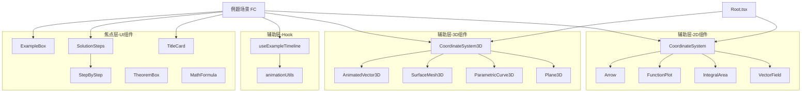

# 可复用例题组件架构规划

> 基于 Polanyi 默会知识原则 · 同济第七版高数下册 Remotion 动画教学项目
>
> 文档版本：v1.0 · 2026-04-10

---

## 目录

1. [设计原则：Polanyi 三层次映射](#1-设计原则polanyi-三层次映射)
2. [新增组件规范](#2-新增组件规范)
3. [Bug 修复方案](#3-bug-修复方案)
4. [各章例题实现计划](#4-各章例题实现计划)
5. [组件组合范式](#5-组件组合范式)

---

## 1. 设计原则：Polanyi 三层次映射

Michael Polanyi 的默会知识（Tacit Knowledge）理论将知识分为三层：**焦点知识**（我们在关注什么）、**辅助知识**（支撑焦点的工具与背景）、**默会知识**（无法完整言说的能力本身）。本架构将这三层直接映射为组件责任边界。

### 1.1 三层架构总览

```
┌─────────────────────────────────────────────────────────┐
│          焦点知识层（Focal Knowledge Layer）              │
│  ExampleBox · SolutionSteps · ExampleScene · Example3D  │
│  ← 学生/教师直接感知：题目文字、推导步骤、动画结论        │
├─────────────────────────────────────────────────────────┤
│          辅助知识层（Subsidiary Knowledge Layer）         │
│  useExampleTimeline · AnimatedVector3D · SurfaceMesh3D  │
│  ParametricCurve3D · Plane3D                            │
│  ← 支撑焦点的工具：时序、几何对象、坐标变换              │
├─────────────────────────────────────────────────────────┤
│          默会知识层（Tacit Knowledge Layer）              │
│  组件组合范式 · 典型时序模板 · 教学流程节奏              │
│  ← 隐含在代码结构中，通过范式传递给开发者                │
└─────────────────────────────────────────────────────────┘
```

### 1.2 三层的具体职责

| 层次 | 组件/机制 | 职责描述 |
|------|-----------|---------|
| **焦点层** | `ExampleBox` | 题目容器：题号 + 题目文字，统一视觉样式 |
| **焦点层** | `SolutionSteps` | 解题步骤语义封装，在 `StepByStep` 基础上增加数学公式支持 |
| **辅助层** | `useExampleTimeline` | 将帧号映射为语义化时序（标题帧/例题帧/动画帧/总结帧） |
| **辅助层** | `AnimatedVector3D` | 在 `CoordinateSystem3D` 上下文内渲染带方向箭头的 3D 向量 |
| **辅助层** | `SurfaceMesh3D` | 参数化曲面网格，支持绘制进度动画 |
| **辅助层** | `ParametricCurve3D` | 3D 参数曲线，支持描绘进度动画 |
| **辅助层** | `Plane3D` | 3D 平面片段，用于切平面、法平面场景 |
| **默会层** | 组合范式 #1~#4 | 在文档第 5 节中明确说明，供开发者内化 |

### 1.3 层次边界规则

- **焦点层组件不直接操作像素/帧号**：只接收语义化 Props（`step: number`、`progress: number`），不调用 `useCurrentFrame()`
- **辅助层组件只关心几何与动画**：不包含业务逻辑，Props 全部为数学量（坐标、颜色、进度）
- **默会层由范式文档固化**：每次新增场景文件时，开发者通过对照范式快速组装，而不是从头设计时序

---

## 2. 新增组件规范

> 所有新组件均位于 `src/components/` 目录下，原有组件不重复实现。

### 2.1 `AnimatedVector3D`

**文件路径**：`src/components/math/AnimatedVector3D.tsx`

**用途**：在 `CoordinateSystem3D` 内绘制 3D 向量箭头，支持渐入动画和标签显示。对标 2D 的 [`Arrow`](src/components/math/Arrow.tsx:1)，但工作于 `useCoordContext3D()` 上下文。

**Props 接口**：

```typescript
interface AnimatedVector3DProps {
  // 起点坐标（数学坐标系）
  from?: [number, number, number];   // 默认 [0, 0, 0]
  // 终点坐标（数学坐标系）
  to: [number, number, number];
  // 颜色，默认 COLORS.vector (#ffd700)
  color?: string;
  // 线宽，默认 3
  strokeWidth?: number;
  // 可见度 0~1（用于渐入动画）
  opacity?: number;
  // 文字标签（显示在箭头中点旁）
  label?: string;
  // 标签偏移像素 [dx, dy]，默认 [10, -10]
  labelOffset?: [number, number];
  // 箭头头部大小（像素），默认 10
  arrowSize?: number;
}
```

**使用场景**：
- Ch08 向量叉积演示：显示 **a** × **b** 法向量
- Ch09 梯度向量场景：显示梯度方向 grad f
- Ch11 曲面法向量：显示曲面法向量 **n**

**与现有组件的关系**：
- 依赖 `useCoordContext3D()` 来获取 `toISO` 投影函数（来自 [`CoordinateSystem3D.tsx`](src/components/math/CoordinateSystem3D.tsx:18)）
- 类比 [`Arrow.tsx`](src/components/math/Arrow.tsx:1) 的 2D 实现，将 `toPixel` 替换为 `toISO`

---

### 2.2 `SurfaceMesh3D`

**文件路径**：`src/components/math/SurfaceMesh3D.tsx`

**用途**：在 `CoordinateSystem3D` 内绘制参数化曲面的等参线网格（非实体填充），支持绘制进度动画。可用于抛物面 `z = x² + y²`、球面、椭球面等。

**Props 接口**：

```typescript
interface SurfaceMesh3DProps {
  // 参数化曲面函数：(u, v) => [x, y, z]
  parametric: (u: number, v: number) => [number, number, number];
  // u 参数范围
  uRange: [number, number];
  // v 参数范围
  vRange: [number, number];
  // u 方向网格线数量，默认 12
  uLines?: number;
  // v 方向网格线数量，默认 12
  vLines?: number;
  // 每条线的采样点数，默认 40
  samples?: number;
  // 主色（u 方向线），默认 COLORS.primaryCurve
  colorU?: string;
  // 副色（v 方向线），默认 COLORS.secondaryCurve
  colorV?: string;
  // 线宽，默认 1.2
  strokeWidth?: number;
  // 整体透明度 0~1
  opacity?: number;
  // 绘制进度 0~1（0 不显示，1 完整显示），用于 drawProgress 动画
  drawProgress?: number;
}
```

**使用场景**：
- Ch08 二次曲面：椭球面、抛物面、双曲面的 3D 展示
- Ch09 偏导数几何意义：曲面 z = f(x,y) 上的切线方向
- Ch10 三重积分：积分区域的曲面边界
- Ch11 曲面积分：被积曲面的网格可视化

**与现有组件的关系**：
- 依赖 `useCoordContext3D()` 获取 `toISO` 函数
- 不依赖 [`FunctionPlot`](src/components/math/FunctionPlot.tsx:1)（FunctionPlot 仅用于 2D）

---

### 2.3 `ParametricCurve3D`

**文件路径**：`src/components/math/ParametricCurve3D.tsx`

**用途**：在 `CoordinateSystem3D` 内绘制 3D 参数曲线（如螺旋线、椭圆周），支持描绘进度动画和方向箭头。

**Props 接口**：

```typescript
interface ParametricCurve3DProps {
  // 参数曲线函数：t => [x, y, z]
  parametric: (t: number) => [number, number, number];
  // 参数范围
  tRange: [number, number];
  // 采样点数，默认 100
  samples?: number;
  // 颜色，默认 COLORS.primaryCurve
  color?: string;
  // 线宽，默认 2.5
  strokeWidth?: number;
  // 透明度
  opacity?: number;
  // 描绘进度 0~1
  drawProgress?: number;
  // 是否在曲线末端显示方向箭头
  showArrow?: boolean;
  // 箭头大小（像素），默认 10
  arrowSize?: number;
}
```

**使用场景**：
- Ch08 空间曲线：螺旋线 `(cos t, sin t, t)`
- Ch09 复合函数：空间参数曲线上的梯度方向
- Ch11 第二类曲线积分：3D 空间中的积分路径

**与现有组件的关系**：
- 依赖 `useCoordContext3D()` 获取 `toISO` 函数
- 类比 [`FunctionPlot`](src/components/math/FunctionPlot.tsx:1) 的描绘动画机制，但工作于 3D 上下文

---

### 2.4 `Plane3D`

**文件路径**：`src/components/math/Plane3D.tsx`

**用途**：在 `CoordinateSystem3D` 内绘制有限大小的 3D 平面片段（填充多边形），用于展示切平面、法平面、坐标平面等。

**Props 接口**：

```typescript
interface Plane3DProps {
  // 平面法向量 [a, b, c]（用于 ax + by + cz = d）
  normal: [number, number, number];
  // 平面常数 d
  d: number;
  // 平面中心点（用于确定显示区域）
  center?: [number, number, number];
  // 平面显示的半径范围（数学单位），默认 2
  extent?: number;
  // 填充颜色，默认 COLORS.primaryCurve + 透明
  fillColor?: string;
  // 填充透明度，默认 0.25
  fillOpacity?: number;
  // 边框颜色
  strokeColor?: string;
  // 边框宽度，默认 2
  strokeWidth?: number;
  // 整体透明度 0~1
  opacity?: number;
}
```

**使用场景**：
- Ch09 全微分：切平面演示 `z - z₀ = fx'(x-x₀) + fy'(y-y₀)`
- Ch09 曲面法平面：与曲线切线垂直的平面
- Ch08 平面方程：三点确定平面的几何直觉

**与现有组件的关系**：
- 依赖 `useCoordContext3D()` 获取 `toISO` 函数
- 平面范围通过在法向量垂直子空间内采样 4 个角点来确定多边形

---

### 2.5 `ExampleBox`

**文件路径**：`src/components/ui/ExampleBox.tsx`

**用途**：例题容器组件，统一显示「例 N」标题和题目文字，是焦点知识层的入口组件。

**Props 接口**：

```typescript
interface ExampleBoxProps {
  // 例题编号，如 "例1"、"例8.3.2"
  exampleNum: string;
  // 题目文字（支持字符串或 React 节点，用于嵌入 MathFormula）
  children: React.ReactNode;
  // 整体透明度（用于渐入动画）
  opacity?: number;
  // 强调色（例题编号背景色），默认 COLORS.primaryCurve
  accentColor?: string;
  // 宽度，默认 "100%"
  width?: number | string;
}
```

**使用场景**：所有包含例题的 Sec 文件的「例题展示」场景段（90-210 帧区间）

**与现有组件的关系**：
- 类比 [`TheoremBox`](src/components/ui/TheoremBox.tsx:1) 的视觉风格，但语义为「例题」而非「定理」
- 可嵌入 [`MathFormula`](src/components/math/MathFormula.tsx:1) 来显示 LaTeX 公式

---

### 2.6 `SolutionSteps`

**文件路径**：`src/components/ui/SolutionSteps.tsx`

**用途**：解题步骤组件，在 [`StepByStep`](src/components/ui/StepByStep.tsx:1) 基础上增加：①支持 LaTeX 公式步骤、②显示步骤标题（"解："、"令 u = ..."）、③当前步骤高亮。

**Props 接口**：

```typescript
interface SolutionStep {
  // 步骤标题（纯文字，显示在步骤前）
  label?: string;
  // 步骤内容（字符串或 ReactNode，可嵌入 MathFormula）
  content: React.ReactNode;
  // 该步骤的强调颜色，默认使用主色
  highlightColor?: string;
}

interface SolutionStepsProps {
  steps: SolutionStep[];
  // 当前显示到第几步（0-indexed）
  currentStep: number;
  // 整体透明度
  opacity?: number;
  // 步骤间距，默认 16
  gap?: number;
}
```

**使用场景**：所有章节例题的「解题步骤」动画段（210-390 帧区间）

**与现有组件的关系**：
- 包装 [`StepByStep`](src/components/ui/StepByStep.tsx:1)，增加 `SolutionStep` 类型支持 ReactNode 内容
- 与 [`MathFormula`](src/components/math/MathFormula.tsx:1) 组合使用，渲染每步的 LaTeX 公式

---

### 2.7 `useExampleTimeline`（Hook）

**文件路径**：`src/hooks/useExampleTimeline.ts`

**用途**：将原始帧号转换为语义化的时序数据，实现辅助知识层的时序管理，避免在场景组件中散落大量 `interpolate` 调用。

**接口**：

```typescript
interface ExampleTimelineConfig {
  // 各段帧数（默认值如下）
  titleDuration?: number;      // 标题场景帧数，默认 90
  problemDuration?: number;    // 例题展示帧数，默认 120
  animationDuration?: number;  // 动画演示帧数，默认 180
  summaryDuration?: number;    // 总结场景帧数，默认 90
}

interface ExampleTimelineResult {
  // 当前所在场景阶段
  phase: 'title' | 'problem' | 'animation' | 'summary';
  // 各场景渐入透明度（0~1）
  titleOpacity: number;
  problemOpacity: number;
  animationOpacity: number;
  summaryOpacity: number;
  // 动画段内的进度（0~1），用于 drawProgress / currentStep 计算
  animationProgress: number;
  // 当前步骤索引（基于 animationProgress 和 totalSteps 计算）
  currentStep: (totalSteps: number) => number;
}

function useExampleTimeline(config?: ExampleTimelineConfig): ExampleTimelineResult
```

**使用场景**：每个包含例题的 Sec 组件的顶层，替代手工计算各段 fade 值

---

## 3. Bug 修复方案

### 3.1 P0：Index Composition 帧数错误

**问题描述**：[`src/Root.tsx`](src/Root.tsx:132) 中 6 个章节索引 Composition 的 `durationInFrames` 均为 `300`，但这些索引页仅需展示章节标题卡，实际只需 150 帧（5 秒）。错误设置会导致渲染时间浪费，且与各节正文帧数不一致。

**影响范围**：
- `Ch07-Index`（第 138 行）
- `Ch08-Index`（第 162 行）
- `Ch09-Index`（第 180 行）
- `Ch10-Index`（第 202 行）
- `Ch11-Index`（第 216 行）
- `Ch12-Index`（第 236 行）

**修复方案**：

将所有 Index Composition 的 `durationInFrames` 统一改为 `150`（章节标题页只需 5 秒展示，淡入 + 停留 + 淡出）：

```typescript
// 修复前
<Composition id="Ch07-Index" component={WCh07Index}
  durationInFrames={300} fps={VIDEO_CONFIG.fps} ... />

// 修复后
<Composition id="Ch07-Index" component={WCh07Index}
  durationInFrames={150} fps={VIDEO_CONFIG.fps} ... />
```

6 个 Index 组件全部改为 150，其余已配置正确帧数的 Composition 不变。

---

### 3.2 P1：Sec02_Line2 中 IIFE 违反 Hook 规则

**问题描述**：[`src/compositions/Ch11_LineAndSurface/Sec02_Line2.tsx`](src/compositions/Ch11_LineAndSurface/Sec02_Line2.tsx:170) 第 170-179 行在 JSX 内部使用 IIFE 调用 `WorkPathLine` 组件，而 `WorkPathLine` 内部调用了 `useCoordContext()` Hook：

```tsx
// 当前问题代码（第 170-179 行）
{s2PathOp > 0 && (() => {
  const pathPts: Array<[number, number]> = Array.from({ length: N + 1 }, (_, i) => {
    const tt = i / N;
    return [-1 + 2 * tt, -0.5 + tt] as [number, number];
  });
  return (
    <WorkPathLine
      points={pathPts}
      progress={Math.min(1, s2PathOp / 0.7)}
    />
  );
})()}
```

**问题根源**：IIFE 中的逻辑（路径点数组生成）混杂了数据计算和 JSX 渲染，虽然 Hook 本身在 `WorkPathLine` FC 内部调用（不直接违反 Hook 规则），但 IIFE 模式使 React 无法正确追踪组件边界，在某些 React 版本下会导致渲染异常，也违反了可读性和可维护性原则。

**修复方案**：将路径点计算提升到组件函数体顶层，在 JSX 中直接渲染 `<WorkPathLine>`：

```tsx
// 修复后：在 Sec02Line2 函数体顶层计算路径点
const N = 20;
const s2PathPts: Array<[number, number]> = Array.from({ length: N + 1 }, (_, i) => {
  const tt = i / N;
  return [-1 + 2 * tt, -0.5 + tt] as [number, number];
});

// JSX 中直接使用，不再用 IIFE
{s2PathOp > 0 && (
  <WorkPathLine
    points={s2PathPts}
    progress={Math.min(1, s2PathOp / 0.7)}
    color={COLORS.primaryCurve}
    opacity={s2PathOp}
  />
)}
```

**注意**：修复后需检查 `N` 变量是否与文件中其他位置的 `N` 命名冲突，如有则重命名为 `PATH_N` 或类似。

---

## 4. 各章例题实现计划

### 标准帧数分配模板

```
帧   0 ─── 90 ────────── 210 ─────────────── 390 ──── 480
     │  标题场景  │  例题展示  │   动画演示    │  总结  │
     │  TitleCard │ ExampleBox │ SolutionSteps │Summary │
     │   90帧     │   120帧    │    180帧      │  90帧  │
```

对于 3D 例题（几何内容较复杂），可调整为：

```
帧   0 ─── 90 ──── 180 ──────────────── 420 ── 480
     │ 标题 │ 例题  │   3D动画演示       │ 总结 │
     │ 90帧 │ 90帧  │     240帧          │ 60帧 │
```

---

### 4.1 第八章：空间解析几何与向量代数（Ch08）

**例题 8.1：向量叉积的几何意义**

| 段落 | 帧范围 | 组件 | 动画要点 |
|------|--------|------|----------|
| 标题 | 0-90 | `TitleCard` | 章节标题淡入 |
| 例题 | 90-180 | `ExampleBox` + `MathFormula` | 题目显示：已知 a=(1,2,3), b=(2,1,0)，求 a×b |
| 动画 | 180-420 | `CoordinateSystem3D` + `AnimatedVector3D` × 3 | ①绘制向量 a（金色）② 绘制向量 b（粉色）③ 绘制叉积向量（红色，从原点出发）④ 标注 a×b=(-3,6,-3) |
| 总结 | 420-480 | `SolutionSteps` | 计算步骤：行列式展开 |

**例题 8.2：曲面方程识别（旋转抛物面）**

| 段落 | 帧范围 | 组件 | 动画要点 |
|------|--------|------|----------|
| 标题 | 0-90 | `TitleCard` | 淡入 |
| 例题 | 90-180 | `ExampleBox` | 题目：画出 z = x² + y² 的图形 |
| 动画 | 180-420 | `CoordinateSystem3D` + `SurfaceMesh3D` | ① 建立坐标系 ② drawProgress: 0→1 绘制抛物面网格 ③ 标注顶点(0,0,0)和截面圆 |
| 总结 | 420-480 | `MathFormula` | 旋转抛物面标准方程 |

---

### 4.2 第九章：多元函数微分学（Ch09）

**例题 9.1：全微分与切平面**

| 段落 | 帧范围 | 组件 | 动画要点 |
|------|--------|------|----------|
| 标题 | 0-90 | `TitleCard` | 淡入 |
| 例题 | 90-210 | `ExampleBox` + `MathFormula` | 题目：求 z = x² + y² 在点(1,1,2)处的切平面方程 |
| 动画 | 210-390 | `CoordinateSystem3D` + `SurfaceMesh3D` + `Plane3D` + `AnimatedVector3D` | ①绘制曲面网格 ②标注点(1,1,2)（红点）③淡入切平面（半透明蓝色面片）④显示法向量 **n** |
| 总结 | 390-480 | `SolutionSteps` | 步骤：求偏导 → 代入坐标 → 写出切平面方程 |

**例题 9.2：梯度方向最速上升**

| 段落 | 帧范围 | 组件 | 动画要点 |
|------|--------|------|----------|
| 标题 | 0-90 | `TitleCard` | 淡入 |
| 例题 | 90-210 | `ExampleBox` | 题目：求 f = x² + 2y² 在点(1,1)的梯度方向 |
| 动画 | 210-390 | `CoordinateSystem` + `VectorField` + `Arrow` | ①等高线族（多个 FunctionPlot）②标注点(1,1)③渐入梯度向量箭头(2,4) |
| 总结 | 390-480 | `SolutionSteps` | 梯度计算步骤 |

---

### 4.3 第十章：重积分（Ch10）

**例题 10.1：二重积分换序**

| 段落 | 帧范围 | 组件 | 动画要点 |
|------|--------|------|----------|
| 标题 | 0-90 | `TitleCard` | 淡入 |
| 例题 | 90-210 | `ExampleBox` + `MathFormula` | 题目：把积分 ∫₀¹∫ₓ¹ f(x,y) dy dx 改变积分顺序 |
| 动画 | 210-390 | `CoordinateSystem` + `IntegralArea` | ①绘制积分区域 D（三角形）②标注 x 型积分上下限边界线③重新标注 y 型积分上下限④区域填充颜色变化 |
| 总结 | 390-480 | `SolutionSteps` | 换序步骤：画图 → 确定新限 → 写出结果 |

**例题 10.2：极坐标二重积分**

| 段落 | 帧范围 | 组件 | 动画要点 |
|------|--------|------|----------|
| 标题 | 0-90 | `TitleCard` | 淡入 |
| 例题 | 90-210 | `ExampleBox` + `MathFormula` | 题目：计算 ∬_D (x²+y²) dσ，D: x²+y²≤R² |
| 动画 | 210-390 | `CoordinateSystem` + `IntegralArea` | ①圆形积分区域 D（`IntegralArea` fillProgress）②标注极坐标变量 r, θ ③动画演示扇形微元 r·dr·dθ |
| 总结 | 390-480 | `SolutionSteps` | 极坐标变换步骤 |

---

### 4.4 第十一章：曲线积分与曲面积分（Ch11）

**例题 11.1：第一类曲线积分计算**

| 段落 | 帧范围 | 组件 | 动画要点 |
|------|--------|------|----------|
| 标题 | 0-90 | `TitleCard` | 淡入 |
| 例题 | 90-210 | `ExampleBox` + `MathFormula` | 题目：∫_L (x²+y²) ds，L 为单位圆 |
| 动画 | 210-390 | `CoordinateSystem` + `FunctionPlot` | ①绘制单位圆路径（drawProgress）②标注参数化 x=cos t, y=sin t ③高亮弧长微元 ds |
| 总结 | 390-480 | `SolutionSteps` | 参数化 → 代入 → 积分计算 |

**例题 11.2：Green 公式应用**

| 段落 | 帧范围 | 组件 | 动画要点 |
|------|--------|------|----------|
| 标题 | 0-90 | `TitleCard` | 淡入 |
| 例题 | 90-210 | `ExampleBox` + `MathFormula` | 题目：利用 Green 公式计算曲线积分 |
| 动画 | 210-390 | `CoordinateSystem` + `IntegralArea` + `VectorField` | ①绘制封闭曲线 L（正方向标注）②填充区域 D ③显示向量场 P,Q ④演示 Green 公式等价关系 |
| 总结 | 390-480 | `SolutionSteps` | 验证 Green 条件 → 计算二重积分 |

**例题 11.3：第一类曲面积分（面积型）**

| 段落 | 帧范围 | 组件 | 动画要点 |
|------|--------|------|----------|
| 标题 | 0-90 | `TitleCard` | 淡入 |
| 例题 | 90-210 | `ExampleBox` + `MathFormula` | 题目：∬_S (x+y+z) dS，S 为球面 x²+y²+z²=1 在第一卦限 |
| 动画 | 210-420 | `CoordinateSystem3D` + `SurfaceMesh3D` | ①建立 3D 坐标系 ②绘制球面网格（第一卦限部分）③标注面积微元 dS ④显示法向量 |
| 总结 | 420-480 | `SolutionSteps` | 参数化 → 计算 dS → 代入积分 |

---

### 4.5 第十二章：无穷级数（Ch12）

**例题 12.1：幂级数收敛半径**

| 段落 | 帧范围 | 组件 | 动画要点 |
|------|--------|------|----------|
| 标题 | 0-90 | `TitleCard` | 淡入 |
| 例题 | 90-210 | `ExampleBox` + `MathFormula` | 题目：求 Σ (x^n / n) 的收敛半径 R |
| 动画 | 210-390 | `CoordinateSystem` + `FunctionPlot` | ①数轴上标注收敛区间 (-R, R) ②逐步绘制部分和函数 S_N(x) 曲线（N=1,5,10,20）③曲线向 ln(1/(1-x)) 收敛的动画 |
| 总结 | 390-480 | `SolutionSteps` | 比值法计算步骤 |

**例题 12.2：Fourier 展开**

| 段落 | 帧范围 | 组件 | 动画要点 |
|------|--------|------|----------|
| 标题 | 0-90 | `TitleCard` | 淡入 |
| 例题 | 90-210 | `ExampleBox` + `MathFormula` | 题目：将 f(x)=x 在 [-π, π] 展开为 Fourier 级数 |
| 动画 | 210-390 | `FourierSeries` | 使用现有 `FourierSeries` 组件，展示项数 N 从 1 增加到 20 时的逼近效果 |
| 总结 | 390-480 | `SolutionSteps` | Fourier 系数计算 aₙ, bₙ |

---

## 5. 组件组合范式

> 这一节属于**默会知识层**：通过代码模板固化"正确的组装方式"，让开发者内化组合节奏，不需要每次重新设计。

---

### 范式 #1：标准 2D 例题场景

适用于：二重积分换序、Green 公式、级数收敛等**平面问题**例题。

```tsx
// 文件：src/compositions/ChXX_YYY/SecNN_Example.tsx
import React from "react";
import { AbsoluteFill, useCurrentFrame } from "remotion";
import { COLORS } from "../../constants/colorTheme";
import { TitleCard } from "../../components/ui/TitleCard";
import { ExampleBox } from "../../components/ui/ExampleBox";
import { SolutionSteps } from "../../components/ui/SolutionSteps";
import { CoordinateSystem } from "../../components/math/CoordinateSystem";
import { IntegralArea } from "../../components/math/IntegralArea";
import { MathFormula } from "../../components/math/MathFormula";
import { useExampleTimeline } from "../../hooks/useExampleTimeline";

const ExampleScene: React.FC = () => {
  const frame = useCurrentFrame();
  const {
    phase,
    titleOpacity,
    problemOpacity,
    animationProgress,
    summaryOpacity,
    currentStep,
  } = useExampleTimeline(); // 默认 90/120/180/90 帧分配

  const steps = [
    { label: "第一步：", content: <MathFormula formula="..." /> },
    { label: "第二步：", content: <MathFormula formula="..." /> },
    { label: "结果：",   content: <MathFormula formula="..." /> },
  ];

  return (
    <AbsoluteFill style={{ backgroundColor: COLORS.background }}>
      {/* 焦点层：标题 */}
      {phase === 'title' && (
        <TitleCard chapterNum="X" chapterTitle="..." sectionNum="X.N"
          sectionTitle="..." opacity={titleOpacity} />
      )}

      {/* 焦点层：例题展示 */}
      {(phase === 'problem' || phase === 'animation') && (
        <AbsoluteFill style={{ flexDirection: "column", padding: 60, gap: 24 }}>
          <ExampleBox exampleNum="例1" opacity={problemOpacity}>
            <MathFormula formula="\iint_D f(x,y)\,d\sigma" />
          </ExampleBox>

          {/* 辅助层：坐标系 + 积分区域 */}
          {phase === 'animation' && (
            <CoordinateSystem width={800} height={480} xRange={[0, 2]} yRange={[0, 2]}>
              <IntegralArea
                f={(x) => x}
                g={(_x) => 0}
                xMin={0} xMax={1}
                fillProgress={animationProgress}
                color={COLORS.primaryCurve}
              />
            </CoordinateSystem>
          )}
        </AbsoluteFill>
      )}

      {/* 焦点层：总结/步骤 */}
      {phase === 'summary' && (
        <AbsoluteFill style={{ padding: 80, justifyContent: "center" }}>
          <SolutionSteps
            steps={steps}
            currentStep={currentStep(steps.length)}
            opacity={summaryOpacity}
          />
        </AbsoluteFill>
      )}
    </AbsoluteFill>
  );
};

export default ExampleScene;
```

---

### 范式 #2：标准 3D 例题场景

适用于：曲面方程、切平面、曲面积分等**空间问题**例题。

```tsx
// 辅助层：3D 几何对象全部放在 CoordinateSystem3D 内
const Example3DScene: React.FC = () => {
  const frame = useCurrentFrame();
  const { phase, titleOpacity, problemOpacity, animationProgress } =
    useExampleTimeline({ animationDuration: 240 }); // 3D 场景多给 60 帧

  return (
    <AbsoluteFill style={{ backgroundColor: COLORS.background }}>
      {phase === 'title' && <TitleCard ... />}

      {(phase === 'problem' || phase === 'animation') && (
        <AbsoluteFill style={{ flexDirection: "row", padding: 40 }}>
          {/* 左侧：题目文字（焦点层） */}
          <div style={{ width: 480 }}>
            <ExampleBox exampleNum="例2" opacity={problemOpacity}>
              <MathFormula formula="z = x^2 + y^2" />
            </ExampleBox>
          </div>

          {/* 右侧：3D 图形（辅助层） */}
          {phase === 'animation' && (
            <svg width={700} height={500}>
              <CoordinateSystem3D
                center={[350, 380]} scale={55}
                xRange={[-3, 3]} yRange={[-3, 3]} zRange={[0, 5]}
              >
                {/* 曲面 */}
                <SurfaceMesh3D
                  parametric={(u, v) => [u, v, u * u + v * v]}
                  uRange={[-2, 2]} vRange={[-2, 2]}
                  drawProgress={animationProgress}
                  colorU={COLORS.primaryCurve}
                  colorV={COLORS.secondaryCurve}
                />
                {/* 切平面（在特定点） */}
                {animationProgress > 0.7 && (
                  <Plane3D
                    normal={[-2, -2, 1]} d={-2}
                    center={[1, 1, 2]}
                    fillColor={COLORS.highlight}
                    fillOpacity={0.2}
                    opacity={(animationProgress - 0.7) / 0.3}
                  />
                )}
              </CoordinateSystem3D>
            </svg>
          )}
        </AbsoluteFill>
      )}
    </AbsoluteFill>
  );
};
```

---

### 范式 #3：逐步推导场景

适用于：分部积分、换元计算、Fourier 系数求解等**纯计算**例题（无需坐标系）。

```tsx
// 纯推导场景：SolutionSteps 作为主角，用 animationProgress 驱动步骤
const DerivationScene: React.FC = () => {
  const { phase, titleOpacity, animationProgress, summaryOpacity } =
    useExampleTimeline({ problemDuration: 60, animationDuration: 240 });

  const STEPS = [
    { label: "令 u = x：", content: <MathFormula formula="u = x,\; dv = e^x dx" /> },
    { label: "则：",        content: <MathFormula formula="du = dx,\; v = e^x" /> },
    { label: "分部积分：",  content: <MathFormula formula="\int x e^x dx = xe^x - \int e^x dx" /> },
    { label: "化简：",      content: <MathFormula formula="= (x-1)e^x + C" /> },
  ];

  // 将 animationProgress 映射为当前步骤索引
  const step = Math.floor(animationProgress * STEPS.length);

  return (
    <AbsoluteFill style={{ backgroundColor: COLORS.background, padding: 80 }}>
      {phase === 'title' && <TitleCard ... />}

      {phase !== 'title' && (
        <div style={{ display: "flex", flexDirection: "column", gap: 40 }}>
          <ExampleBox exampleNum="例3" opacity={1}>
            <MathFormula formula="\int x e^x \, dx" />
          </ExampleBox>
          <SolutionSteps steps={STEPS} currentStep={step} />
        </div>
      )}
    </AbsoluteFill>
  );
};
```

---

### 范式 #4：双列对比场景

适用于：积分换序（x 型 vs y 型）、格林公式（曲线积分 ↔ 二重积分）等需要**左右对比**的例题。

```tsx
// 双列布局：左右分栏显示两种积分顺序
const ComparisonScene: React.FC = () => {
  const { animationProgress } = useExampleTimeline();

  // 左右两侧分别使用不同进度驱动
  const leftProgress  = Math.min(1, animationProgress * 2);       // 前半段
  const rightProgress = Math.max(0, animationProgress * 2 - 1);  // 后半段

  return (
    <AbsoluteFill style={{ backgroundColor: COLORS.background, flexDirection: "row" }}>
      {/* 左侧：x 型积分区域 */}
      <div style={{ flex: 1, padding: 40 }}>
        <div style={{ color: COLORS.primaryCurve, fontSize: 24 }}>先对 y 积分</div>
        <CoordinateSystem width={500} height={400} xRange={[0, 1.5]} yRange={[0, 1.5]}>
          <IntegralArea
            f={(x) => 1} g={(x) => x}
            xMin={0} xMax={1}
            fillProgress={leftProgress}
            color={COLORS.primaryCurve}
          />
        </CoordinateSystem>
        <MathFormula formula="\int_0^1 dx \int_x^1 f\,dy" />
      </div>

      {/* 分隔符 */}
      <div style={{ width: 2, backgroundColor: COLORS.axis, margin: "40px 0" }} />

      {/* 右侧：y 型积分区域 */}
      <div style={{ flex: 1, padding: 40 }}>
        <div style={{ color: COLORS.secondaryCurve, fontSize: 24 }}>先对 x 积分</div>
        <CoordinateSystem width={500} height={400} xRange={[0, 1.5]} yRange={[0, 1.5]}>
          <IntegralArea
            f={(_y) => _y} g={(_y) => 0}
            xMin={0} xMax={1}
            fillProgress={rightProgress}
            color={COLORS.secondaryCurve}
          />
        </CoordinateSystem>
        <MathFormula formula="\int_0^1 dy \int_0^y f\,dx" />
      </div>
    </AbsoluteFill>
  );
};
```

---

## 附录：组件依赖关系图



---

*本文档由架构规划阶段生成，实现阶段请切换至 Code 模式。*
