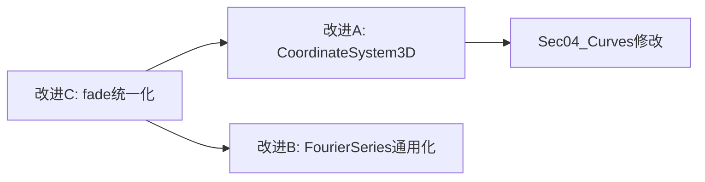

# P3 改进项架构规划文档

> 版本：v1.0 | 日期：2026-04-08 | 项目：`/Users/zsk/Downloads/code/math`

---

## 目录

1. [改进A：CoordinateSystem3D 等距投影组件](#改进a-coordinatesystem3d-等距投影组件)
2. [改进B：FourierSeries 组件通用化](#改进b-fourierseries-组件通用化)
3. [改进C：fade() API 统一化](#改进c-fade-api-统一化)

---

## 改进A：CoordinateSystem3D 等距投影组件

### A.1 设计目标

在 `src/components/math/CoordinateSystem3D.tsx` 中创建纯 SVG 等轴测 3D 坐标系组件，使 `Ch08_VectorGeometry` 中的三维内容（空间曲线、曲面、向量等）获得真实的 3D 直觉表达。

### A.2 等轴测投影数学公式

**等轴测投影标准定义**（ISO 等轴测，三轴夹角各为 120°）：

```
cos30° = √3/2 ≈ 0.8660
sin30° = 1/2  = 0.5000

svgX = cx + (x - y) * cos30° * scale
svgY = cy - z * scale + (x + y) * sin30° * scale
```

**三条坐标轴在 SVG 中的方向**：
- X 轴：向右下方，角度 +30°（东偏南 30°）
- Y 轴：向左下方，角度 +150°（西偏南 30°）
- Z 轴：竖直向上（SVG Y 轴负方向）

**推导过程**：

```
3D点 (x, y, z) 映射到 SVG 坐标 (svgX, svgY)：

X轴方向向量：( cos(-30°),  sin(-30°) ) = ( √3/2,  1/2 )
Y轴方向向量：( cos(210°),  sin(210°) ) = (-√3/2,  1/2 )
Z轴方向向量：( 0,          -1         )

svgX = cx + x*(√3/2)*scale + y*(-√3/2)*scale + z*0
     = cx + (x - y) * (√3/2) * scale

svgY = cy + x*(1/2)*scale  + y*(1/2)*scale  + z*(-1)*scale
     = cy + (x + y) * (1/2) * scale - z * scale
```

### A.3 TypeScript 接口定义

```typescript
// src/components/math/CoordinateSystem3D.tsx

/** toISO 函数：将 3D 数学坐标转为 SVG 像素坐标 */
export type ToISOFn = (x: number, y: number, z: number) => { svgX: number; svgY: number };

/** 3D 坐标系 Context 类型 */
export interface CoordContext3DType {
  toISO: ToISOFn;
  center: [number, number];   // SVG 原点像素坐标 [cx, cy]
  scale: number;
  xRange: [number, number];
  yRange: [number, number];
  zRange: [number, number];
}

/** CoordinateSystem3D 组件 Props */
export interface CoordinateSystem3DProps {
  /** SVG 画布宽度，默认 600 */
  width?: number;
  /** SVG 画布高度，默认 500 */
  height?: number;
  /** 原点在 SVG 中的像素位置 [cx, cy]，默认 [300, 350] */
  center?: [number, number];
  /** 每单位数学长度对应的像素数，默认 60 */
  scale?: number;
  /** X 轴数学范围，默认 [-4, 4] */
  xRange?: [number, number];
  /** Y 轴数学范围，默认 [-4, 4] */
  yRange?: [number, number];
  /** Z 轴数学范围，默认 [0, 4] */
  zRange?: [number, number];
  /** 是否显示 XY 平面地面网格，默认 true */
  showGrid?: boolean;
  /** 网格线步长，默认 1 */
  gridStep?: number;
  /** 整体不透明度，默认 1 */
  opacity?: number;
  /** 子组件（曲线、曲面等 SVG 元素） */
  children?: React.ReactNode;
}
```

### A.4 Context 机制设计

与现有 [`CoordinateSystem.tsx`](src/components/math/CoordinateSystem.tsx:15) 保持一致的 Context 模式：

```typescript
// 创建 Context
export const CoordContext3D = createContext<CoordContext3DType | null>(null);

// Hook（与 useCoordContext 命名模式一致）
export const useCoordContext3D = (): CoordContext3DType => {
  const ctx = useContext(CoordContext3D);
  if (!ctx) throw new Error("useCoordContext3D must be used inside CoordinateSystem3D");
  return ctx;
};

// toISO 核心实现（内部 useMemo 缓存）
const createISOTransform = (cx: number, cy: number, scale: number): ToISOFn => {
  const COS30 = Math.sqrt(3) / 2;  // ≈ 0.8660
  const SIN30 = 0.5;
  return (x, y, z) => ({
    svgX: cx + (x - y) * COS30 * scale,
    svgY: cy + (x + y) * SIN30 * scale - z * scale,
  });
};
```

### A.5 组件渲染结构

```
CoordinateSystem3D
├── <svg width height opacity>
│   ├── CoordContext3D.Provider (value={contextValue})
│   │   ├── [地面网格] XY 平面等轴测网格线（showGrid=true 时渲染）
│   │   ├── [X 轴] 从原点沿 X 轴正方向的线 + 箭头 + "x" 标签
│   │   ├── [Y 轴] 从原点沿 Y 轴正方向的线 + 箭头 + "y" 标签
│   │   ├── [Z 轴] 从原点竖直向上的线 + 箭头 + "z" 标签
│   │   └── {children}
```

**XY 平面地面网格绘制逻辑**：
- 沿 X 方向（固定 y=yMin..yMax，x 从 xMin 到 xMax）绘制一组平行线
- 沿 Y 方向（固定 x=xMin..xMax，y 从 yMin 到 yMax）绘制一组平行线
- 所有端点通过 `toISO(x, y, 0)` 转换

**坐标轴箭头**：使用与 [`CoordinateSystem.tsx`](src/components/math/CoordinateSystem.tsx:122) 相同的 `<polygon>` 三角形箭头方式，箭头位置为轴端点。

### A.6 Sec04_Curves.tsx 修改方案

**当前实现**（[`Sec04_Curves.tsx:26-52`](src/compositions/Ch08_VectorGeometry/Sec04_Curves.tsx:26)）：
- 场景 2 中用手工 SVG 绘制 x-z 截面投影（`svgX = 200 + 80*cos(θ)`, `svgY = 200 - height*θ`）
- 场景 4 中绘制 y-z 平面投影

**修改目标**：将场景 2 的螺旋线从"x-z 截面投影"改为"真 3D 等轴测螺旋线"。

**修改内容**：

1. **新增 import**：
   ```typescript
   import { CoordinateSystem3D, useCoordContext3D } from "../../components/math/CoordinateSystem3D";
   ```

2. **提取螺旋线子组件**（利用 Context hook）：
   ```typescript
   const HelixCurve3D: React.FC<{ progress: number }> = ({ progress }) => {
     const { toISO } = useCoordContext3D();
     const totalPoints = 200;
     const drawnCount = Math.floor(progress * totalPoints);
     const points: string[] = [];
     for (let i = 0; i < drawnCount; i++) {
       const theta = (i / totalPoints) * 4 * Math.PI;
       const x = Math.cos(theta);       // a=1
       const y = Math.sin(theta);       // a=1
       const z = theta / (2 * Math.PI); // b=1/(2π)，即 z∈[0,2]
       const { svgX, svgY } = toISO(x, y, z);
       points.push(`${svgX},${svgY}`);
     }
     return points.length > 1 ? (
       <polyline points={points.join(" ")} fill="none"
         stroke={COLORS.primaryCurve} strokeWidth="2.5" />
     ) : null;
   };
   ```

3. **场景 2 右侧 SVG 替换**：将现有的裸 `<svg>` 块（[`Sec04_Curves.tsx:136-154`](src/compositions/Ch08_VectorGeometry/Sec04_Curves.tsx:136)）替换为：
   ```tsx
   <CoordinateSystem3D
     width={280} height={320}
     center={[140, 260]}
     scale={55}
     xRange={[-1.5, 1.5]}
     yRange={[-1.5, 1.5]}
     zRange={[0, 2.5]}
     showGrid={true}
   >
     <HelixCurve3D progress={helixProgress} />
   </CoordinateSystem3D>
   ```

4. **删除原有 helixPoints 计算逻辑**（[`Sec04_Curves.tsx:31-38`](src/compositions/Ch08_VectorGeometry/Sec04_Curves.tsx:31)），改由 `HelixCurve3D` 内部计算。

**改动范围评估**：
- 新增文件：`src/components/math/CoordinateSystem3D.tsx`（约 130 行）
- 修改文件：`src/compositions/Ch08_VectorGeometry/Sec04_Curves.tsx`（改动约 30 行）

---

## 改进B：FourierSeries 组件通用化

### B.1 现有实现分析

[`src/components/math/FourierSeries.tsx`](src/components/math/FourierSeries.tsx:1) 当前实现：
- **硬编码方波公式**（[第 23-29 行](src/components/math/FourierSeries.tsx:23)）：`bn = 4/(nπ) / (2k-1)`，仅支持方波
- **依赖 Context**：通过 `useCoordContext()` 获取坐标变换和 `xRange`
- **Props 数量**：4 个（`terms`, `drawProgress`, `showPartialSums`, `color`）

### B.2 新的 TypeScript 接口定义

```typescript
// src/components/math/FourierSeries.tsx（新接口）

/** 系数函数类型：给定谐波次数 n，返回余弦系数 an 和正弦系数 bn */
export type FourierCoeffFn = (n: number) => { an: number; bn: number };

/** 内置系数预设名称 */
export type FourierPreset = 'square' | 'sawtooth' | 'triangle';

export interface FourierSeriesProps {
  // ── 原有 Props（完全保留）──────────────────────────────────────────
  /** 展示项数（1, 3, 5... 或任意正整数） */
  terms: number;
  /** 绘制进度 0~1，控制最后一条曲线的 strokeDashoffset 动画 */
  drawProgress?: number;
  /** 是否显示所有中间部分和（半透明），默认 true */
  showPartialSums?: boolean;
  /** 最终曲线颜色，默认 COLORS.primaryCurve */
  color?: string;

  // ── 新增 Props ─────────────────────────────────────────────────────
  /**
   * 傅里叶系数来源：
   * - 'square'   ：方波（默认，保持向后兼容）
   * - 'sawtooth' ：锯齿波
   * - 'triangle' ：三角波
   * - FourierCoeffFn：自定义系数函数
   */
  coefficients?: FourierPreset | FourierCoeffFn;
}
```

> **向后兼容**：`coefficients` 默认为 `'square'`，所有现有调用方无需修改。

### B.3 内置系数函数实现

```typescript
// 内置系数函数（模块级常量，不随渲染重建）

/** 方波：f(x) = (4/π) Σ sin((2k-1)x)/(2k-1)，k=1,2,3... */
const SQUARE_COEFFS: FourierCoeffFn = (n) => ({
  an: 0,
  bn: n % 2 === 1 ? 4 / (n * Math.PI) : 0,
});

/** 锯齿波：f(x) = (2/π) Σ (-1)^(n+1) sin(nx)/n，n=1,2,3... */
const SAWTOOTH_COEFFS: FourierCoeffFn = (n) => ({
  an: 0,
  bn: (2 * Math.pow(-1, n + 1)) / (n * Math.PI),
});

/**
 * 三角波（余弦级数）：f(x) = (8/π²) Σ (-1)^k cos((2k+1)x)/(2k+1)²，k=0,1,2...
 * 用 n=1,3,5... 的余弦项表示（n 为奇数时 an = 8/(n²π²) * (-1)^((n-1)/2)）
 */
const TRIANGLE_COEFFS: FourierCoeffFn = (n) => ({
  an: n % 2 === 1
    ? (8 / (n * n * Math.PI * Math.PI)) * Math.pow(-1, (n - 1) / 2)
    : 0,
  bn: 0,
});

/** 预设名称映射表 */
const PRESET_MAP: Record<FourierPreset, FourierCoeffFn> = {
  square:   SQUARE_COEFFS,
  sawtooth: SAWTOOTH_COEFFS,
  triangle: TRIANGLE_COEFFS,
};
```

### B.4 核心计算函数重构

```typescript
// 通用部分和计算（替换原 partialSum 函数）
const makePartialSum = (coeffFn: FourierCoeffFn) =>
  (x: number, terms: number): number => {
    let sum = 0;
    for (let n = 1; n <= terms; n++) {
      const { an, bn } = coeffFn(n);
      sum += an * Math.cos(n * x) + bn * Math.sin(n * x);
    }
    return sum;
  };
```

### B.5 组件内部修改逻辑

在组件函数体中，添加系数函数解析逻辑：

```typescript
export const FourierSeries: React.FC<FourierSeriesProps> = ({
  terms,
  drawProgress = 1,
  showPartialSums = true,
  color = COLORS.primaryCurve,
  coefficients = 'square',  // 新增，默认方波
}) => {
  const { toPixel, xRange } = useCoordContext();
  const [xMin, xMax] = xRange;

  // 解析系数函数（新增）
  const coeffFn: FourierCoeffFn =
    typeof coefficients === 'function'
      ? coefficients
      : PRESET_MAP[coefficients];

  const partialSum = makePartialSum(coeffFn);

  const paths = useMemo(() => {
    // ... 其余逻辑与原来完全相同，仅将 partialSum(x, n) 的调用保持不变
  }, [terms, drawProgress, color, toPixel, xMin, xMax, coeffFn]);

  return <g>{paths}</g>;
};
```

### B.6 改动量评估

| 改动类型 | 行数 |
|----------|------|
| 新增类型定义（`FourierCoeffFn`, `FourierPreset`） | +8 行 |
| 新增内置系数函数（3 个预设 + 映射表） | +20 行 |
| 新增 `makePartialSum` 工厂函数 | +8 行 |
| Props 接口扩展（新增 `coefficients`） | +8 行 |
| 组件函数体修改（添加解析逻辑，删除旧 `partialSum`） | ±5 行 |
| **总计净增加** | **约 +39 行** |

**修改后文件总行数**：原 52 行 → 约 91 行

**不需要修改的调用方**：
- [`src/compositions/Ch12_Series/Sec06_Fourier.tsx`](src/compositions/Ch12_Series/Sec06_Fourier.tsx)
- [`src/compositions/Ch12_Series/Sec07_Fourier2.tsx`](src/compositions/Ch12_Series/Sec07_Fourier2.tsx)

---

## 改进C：fade() API 统一化

### C.1 问题分析

项目存在语义冲突的两套 `fade` 函数：

| 版本 | 签名 | 第三参数语义 | 使用位置 |
|------|------|------------|--------|
| animationUtils 版本 | `fade(frame, start, end)` | **终止帧** | Sec03, Sec05, Sec06, Sec07 |
| 内联版本（多数文件） | `fade(frame, start, duration)` | **持续帧数** | 项目绝大多数 Sec 文件 |

**决策：统一为 `duration` 语义**，原因：
1. 项目中 80% 以上的文件使用 `duration` 语义（内联定义）
2. `duration` 语义更直觉，与动画领域惯例一致
3. 修改范围明确，仅 4 个文件受影响

### C.2 统一后的 animationUtils.ts 新内容

```typescript
// src/utils/animationUtils.ts（完整新内容）

import { interpolate } from 'remotion';

/**
 * 淡入动画：从 start 帧开始，持续 duration 帧，从 0 插值到 1（双向钳制）
 * @param frame   当前帧
 * @param start   开始帧
 * @param duration 持续帧数（默认 30）
 */
export const fade = (frame: number, start: number, duration = 30): number =>
  interpolate(frame, [start, start + duration], [0, 1], {
    extrapolateLeft: 'clamp',
    extrapolateRight: 'clamp',
  });

/**
 * 淡入动画（指定终止帧语义，保留旧版行为）：
 * 从 start 帧到 end 帧，从 0 插值到 1
 * @param frame 当前帧
 * @param start 开始帧
 * @param end   终止帧
 */
export const fadeToEnd = (frame: number, start: number, end: number): number =>
  interpolate(frame, [start, end], [0, 1], {
    extrapolateLeft: 'clamp',
    extrapolateRight: 'clamp',
  });

/**
 * 在 [start, start+duration] 帧范围内，从 from 平滑插值到 to（双向钳制）
 */
export const lerp = (
  frame: number,
  start: number,
  end: number,
  from: number,
  to: number
): number =>
  interpolate(frame, [start, end], [from, to], {
    extrapolateLeft: 'clamp',
    extrapolateRight: 'clamp',
  });

/**
 * 判断某帧是否已到达指定帧（用于条件显示）
 */
export const isVisible = (frame: number, fromFrame: number): boolean =>
  frame >= fromFrame;

/**
 * 步进显示：currentStep >= targetStep 时返回1，否则0
 */
export const stepOpacity = (currentStep: number, targetStep: number): number =>
  currentStep >= targetStep ? 1 : 0;

/**
 * 弹性淡入：在 [start, start+duration] 帧从 0 到 1，加入轻微过冲效果
 */
export const springFade = (frame: number, start: number, duration: number): number =>
  interpolate(frame, [start, start + duration], [0, 1], {
    extrapolateLeft: 'clamp',
    extrapolateRight: 'clamp',
    easing: (t) => t < 0.5 ? 2 * t * t : -1 + (4 - 2 * t) * t,
  });
```

> **注意**：`lerp` 和 `springFade` 同步改为 `duration` 语义，确保整个模块语义一致。

### C.3 调用点迁移清单

迁移规则：`fade(frame, start, end)` → `fade(frame, start, end - start)`

---

#### 文件 1：Sec03_Homogeneous.tsx

**文件路径**：[`src/compositions/Ch07_DifferentialEq/Sec03_Homogeneous.tsx`](src/compositions/Ch07_DifferentialEq/Sec03_Homogeneous.tsx)

| 行号 | 修改前 | 修改后 |
|------|--------|--------|
| 39 | `fade(frame, 0, 60)` | `fade(frame, 0, 60)` ✓ 无变化（start=0，duration=60） |
| 42 | `fade(frame, 90, 130)` | `fade(frame, 90, 40)` |
| 43 | `fade(frame, 125, 165)` | `fade(frame, 125, 40)` |
| 44 | `fade(frame, 150, 190)` | `fade(frame, 150, 40)` |
| 47 | `fade(frame, 200, 225)` | `fade(frame, 200, 25)` |
| 48 | `fade(frame, 210, 240)` | `fade(frame, 210, 30)` |
| 49 | `fade(frame, 240, 268)` | `fade(frame, 240, 28)` |
| 50 | `fade(frame, 268, 296)` | `fade(frame, 268, 28)` |
| 53 | `fade(frame, 300, 330)` | `fade(frame, 300, 30)` |
| 60 | `fade(frame, 370, 390)` | `fade(frame, 370, 20)` |
| 63 | `fade(frame, 390, 420)` | `fade(frame, 390, 30)` |
| 64 | `fade(frame, 412, 442)` | `fade(frame, 412, 30)` |
| 65 | `fade(frame, 434, 462)` | `fade(frame, 434, 28)` |
| 66 | `fade(frame, 456, 480)` | `fade(frame, 456, 24)` |

**本文件修改点数**：13 处（第 39 行无实质改动）

---

#### 文件 2：Sec05_Exact.tsx

**文件路径**：[`src/compositions/Ch07_DifferentialEq/Sec05_Exact.tsx`](src/compositions/Ch07_DifferentialEq/Sec05_Exact.tsx)

| 行号 | 修改前 | 修改后 |
|------|--------|--------|
| 112 | `fade(frame, 0, 55)` | `fade(frame, 0, 55)` ✓ 无变化 |
| 115 | `fade(frame, 80, 115)` | `fade(frame, 80, 35)` |
| 116 | `fade(frame, 115, 150)` | `fade(frame, 115, 35)` |
| 117 | `fade(frame, 145, 178)` | `fade(frame, 145, 33)` |
| 120 | `fade(frame, 180, 208)` | `fade(frame, 180, 28)` |
| 121 | `fade(frame, 195, 225)` | `fade(frame, 195, 30)` |
| 122 | `fade(frame, 225, 255)` | `fade(frame, 225, 30)` |
| 123 | `fade(frame, 255, 283)` | `fade(frame, 255, 28)` |
| 126 | `fade(frame, 290, 318)` | `fade(frame, 290, 28)` |
| 132 | `fade(frame, 360, 380)` | `fade(frame, 360, 20)` |
| 135 | `fade(frame, 380, 408)` | `fade(frame, 380, 28)` |
| 136 | `fade(frame, 400, 428)` | `fade(frame, 400, 28)` |
| 137 | `fade(frame, 425, 453)` | `fade(frame, 425, 28)` |
| 138 | `fade(frame, 450, 478)` | `fade(frame, 450, 28)` |

**本文件修改点数**：13 处（第 112 行无实质改动）

---

#### 文件 3：Sec06_HighOrder.tsx

**文件路径**：[`src/compositions/Ch07_DifferentialEq/Sec06_HighOrder.tsx`](src/compositions/Ch07_DifferentialEq/Sec06_HighOrder.tsx)

| 行号 | 修改前 | 修改后 |
|------|--------|--------|
| 86 | `fade(frame, 0, 55)` | `fade(frame, 0, 55)` ✓ 无变化 |
| 89 | `fade(frame, 80, 108)` | `fade(frame, 80, 28)` |
| 90 | `fade(frame, 95, 123)` | `fade(frame, 95, 28)` |
| 91 | `fade(frame, 120, 148)` | `fade(frame, 120, 28)` |
| 92 | `fade(frame, 145, 173)` | `fade(frame, 145, 28)` |
| 95 | `fade(frame, 180, 208)` | `fade(frame, 180, 28)` |
| 96 | `fade(frame, 195, 225)` | `fade(frame, 195, 30)` |
| 97 | `fade(frame, 225, 253)` | `fade(frame, 225, 28)` |
| 98 | `fade(frame, 253, 281)` | `fade(frame, 253, 28)` |
| 101 | `fade(frame, 290, 320)` | `fade(frame, 290, 30)` |
| 113 | `fade(frame, 362, 382)` | `fade(frame, 362, 20)` |
| 116 | `fade(frame, 380, 408)` | `fade(frame, 380, 28)` |
| 117 | `fade(frame, 402, 430)` | `fade(frame, 402, 28)` |
| 118 | `fade(frame, 428, 456)` | `fade(frame, 428, 28)` |
| 119 | `fade(frame, 454, 480)` | `fade(frame, 454, 26)` |

**本文件修改点数**：14 处（第 86 行无实质改动）

---

#### 文件 4：Sec07_Linear2.tsx

**文件路径**：[`src/compositions/Ch07_DifferentialEq/Sec07_Linear2.tsx`](src/compositions/Ch07_DifferentialEq/Sec07_Linear2.tsx)

| 行号 | 修改前 | 修改后 |
|------|--------|--------|
| 39 | `fade(frame, 0, 55)` | `fade(frame, 0, 55)` ✓ 无变化 |
| 42 | `fade(frame, 80, 108)` | `fade(frame, 80, 28)` |
| 43 | `fade(frame, 95, 125)` | `fade(frame, 95, 30)` |
| 44 | `fade(frame, 130, 160)` | `fade(frame, 130, 30)` |
| 45 | `fade(frame, 155, 178)` | `fade(frame, 155, 23)` |
| 48 | `fade(frame, 180, 208)` | `fade(frame, 180, 28)` |
| 49 | `fade(frame, 198, 228)` | `fade(frame, 198, 30)` |
| 50 | `fade(frame, 228, 258)` | `fade(frame, 228, 30)` |
| 51 | `fade(frame, 258, 286)` | `fade(frame, 258, 28)` |
| 54 | `fade(frame, 290, 318)` | `fade(frame, 290, 28)` |
| 65 | `fade(frame, 364, 382)` | `fade(frame, 364, 18)` |
| 68 | `fade(frame, 380, 408)` | `fade(frame, 380, 28)` |
| 69 | `fade(frame, 405, 433)` | `fade(frame, 405, 28)` |
| 70 | `fade(frame, 430, 458)` | `fade(frame, 430, 28)` |
| 71 | `fade(frame, 455, 480)` | `fade(frame, 455, 25)` |

**本文件修改点数**：14 处（第 39 行无实质改动）

---

### C.4 迁移汇总

| 文件 | 总调用点 | 实质需修改 |
|------|----------|-----------|
| Sec03_Homogeneous.tsx | 14 | 13 |
| Sec05_Exact.tsx | 14 | 13 |
| Sec06_HighOrder.tsx | 15 | 14 |
| Sec07_Linear2.tsx | 15 | 14 |
| animationUtils.ts | — | 重写 `fade` + 新增 `fadeToEnd` |
| **合计** | **58** | **54 处修改** |

### C.5 迁移验证策略

1. `animationUtils.ts` 修改后，TypeScript 编译器会立即在上述 4 个文件报类型错误（因为第三参数从 `number` 变为 `number`，语义相同但值不同，编译不会报错 —— 需要靠 Review 清单逐行确认）
2. 建议对比修改前后的帧时序：`fade(frame, 90, 130)` 旧版在 frame=90 时开始、130 时完成；新版 `fade(frame, 90, 40)` 同样在 90 开始、130 完成 —— **行为完全等价**

---

## 实施顺序建议



**推荐先做改进C**：影响范围最明确（仅修改现有代码），风险最低，完成后 4 个文件的 `fade` 调用语义与其他文件统一，方便后续维护。

**改进A 和改进B** 可并行进行（互不依赖）。

---

## 文件变更清单

| 操作 | 文件路径 | 说明 |
|------|----------|------|
| **新建** | `src/components/math/CoordinateSystem3D.tsx` | 3D 等轴测坐标系组件（约 130 行） |
| **修改** | `src/components/math/FourierSeries.tsx` | 通用化傅里叶系数（净增约 39 行） |
| **修改** | `src/utils/animationUtils.ts` | fade 改为 duration 语义，新增 fadeToEnd（约 +10 行） |
| **修改** | `src/compositions/Ch07_DifferentialEq/Sec03_Homogeneous.tsx` | 13 处 fade 参数修正 |
| **修改** | `src/compositions/Ch07_DifferentialEq/Sec05_Exact.tsx` | 13 处 fade 参数修正 |
| **修改** | `src/compositions/Ch07_DifferentialEq/Sec06_HighOrder.tsx` | 14 处 fade 参数修正 |
| **修改** | `src/compositions/Ch07_DifferentialEq/Sec07_Linear2.tsx` | 14 处 fade 参数修正 |
| **修改** | `src/compositions/Ch08_VectorGeometry/Sec04_Curves.tsx` | 螺旋线改为 3D 等轴测（改动约 30 行） |
